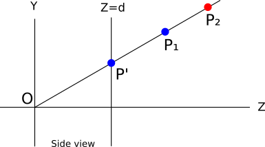
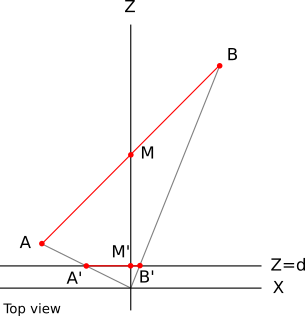
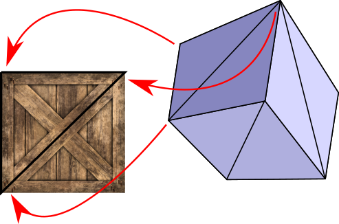

# Introduction

**TL;DR:** This book will *not* teach you how to use OpenGL or DirectX; instead, it
can teach you how OpenGL and DirectX *work*. In practice you won't write a
software renderer for production use, but understanding how and why a renderer works
will let you use OpenGL and DirectX more effectively.

Computer Graphics is a fascinating topic - how do you make *Toy Story* out of
algorithms and some geometric data? Interestingly enough, it's a mysterious
topic not only for the average cinema fan, but also for world-class
engineers who just haven't been exposed to it.

Computer Graphics is also a frighteningly broad topic. From 3D rendering to
photographic image filters, from fonts to particle systems, there's a multitude of
disciplines that can be categorized under CG. This work focuses exclusively on 3D
rendering.

**Computer Graphics from scratch** is my humble attempt to demystify that slice of
Computer Graphics in an accessible way. It can be easily understood by high-school
students, while covering the same topics of an university course. It is, in fact,
based on my years of teaching the subject at my university.

There's little pre-requisite knowledge, nor hardware or software dependencies.
The only primitive used in the book is a method that lets us set the color of a pixel
- hence **"from scratch"**. The algorithms are conceptually simple, and the
math is straightforward. There is some high-school level trigonometry. There's some
basic Linear Algebra as well, but I'm including an appendix that can be consulted as
necessary.

This work is divided in two main parts, **Raytracing** and **Rasterization**, which
focus on the two main ways to make pretty pictures out of data. The **Common concepts**
chapter introduces some basic knowledge necessary to understand these two parts.

The focus of this work is not on performance, but on clear conceptual exposition.
The sample code is, well, *sample code*, written in the most *clear* way possible,
which may not be the most *efficient* way to implement the algorithms. Where there
are different ways to do something, I've chosen the easiest to understand.

The “end result” of this work is two complete, fully functional renderers: a
raytracer and a rasterizer. Although they follow very different approaches, they
produce similar results when used to render a simple scene:

While their sets of features have considerable overlap, they aren’t identical,
so this book covers their specific strenghts:

The book provides sample code throughout the text, as somewhat informal pseudocode;
it also provides fully working implementations written in JavaScript that can run directly
on your browser, rendering to a `canvas` element.

## Why read this?

This work should give you all the knowledge necessary to write software
renderers. Although in the age of GPUs few people have good reasons to write a
pure software renderer, the experience of writing one is valuable for the
following reasons:

1.  **Shaders**. The first GPUs had their algorithms hardcoded in hardware, but in
    modern ones you're expected to write your own shaders. In other words,
    you're still implementing big chunks of rendering software, except it now runs on
    the GPU.

2.  **Understanding**. Whether you're using a fixed pipeline or writing your own
    shaders, *understanding* what's going on behind the scenes lets you use the
    fixed pipeline better and write better shaders.

3.  **Fun**. Few areas of Computer Science have the kind of immediately visible
    results offered by Computer Graphics. The sense of accomplishment you get
    when your SQL query runs just right is *nothing* compared to what you feel
    the first time you get ray traced reflections right. I taught Computer
    Graphics at my university for 5 years. I often wondered why I
    enjoyed teaching the same thing semester after semester for so long; in the
    end, what made it worth it was seeing the faces of my students light up and
    use their first renders as desktop backgrounds. 

## Work in progress

This is a work in progress. Here's a non-exhaustive to do list:

 * Texture filtering
 * Normal mapping
 * Textures in the raytracer
 * Shadows in the rasterizer (stencil and shadow maps)
 * Reflection in the rasterizer
 * Expand the CSG and Refraction sections into chapters
 * Linear algebra appendix
 * Make demos interactive
 * Clean up demo code

Feel free to contribute or to correct mistakes - all the text, diagrams and demos
are in [Github](https://github.com/ggambetta/computer-graphics-from-scratch). PRs welcome!

## About the author

I'm a software engineer who founded and ran a [game development company](http://mysterystudio.com)
(which you haven't heard of), worked at Google (which you have heard of), and now works at
[Improbable](http://improbable.io) (who have a good shot at building the Matrix,
for real - or at the very least revolutionise multiplayer game development).

I taught Computer Graphics for 5 years at my university, where it was a semester-long
3rd year subject. I am grateful to all of my students, who served as unwitting guinea
pigs for the materials that have inspired this book.

I have other interests besides Computer Graphics, engineering-related and otherwise.
See [my website](http://gabrielgambetta.com) for more details and contact information.

# Common concepts

## The Canvas

Throughout this work, we'll be drawing things on a *canvas*. The canvas is a
rectangular array of pixels which can be colored individually. Will this be
shown on a screen, printed on paper, or used as a texture in a subsequent
rendering? That's irrelevant to our purposes; we'll focus on rendering stuff to
this abstract, rectangular array of pixels.

We will build everything in this book out of a single primitive: paint a pixel
in the canvas with a given color:

~~~~~~~~~~~~~~~~~~~~~~~~~~~~~~~~~~~~~~~~~~~~~~~~~~~~~~~~~~~~~~~~~~~~~~~~~~~~~~~~
canvas.PutPixel(x, y, color)
~~~~~~~~~~~~~~~~~~~~~~~~~~~~~~~~~~~~~~~~~~~~~~~~~~~~~~~~~~~~~~~~~~~~~~~~~~~~~~~~

Next we'll examine the parameters to that method - coordinates and colors.

## Coordinate systems

The canvas has a specific width and height in pixels, which we'll call $C_w$ and
$C_h$. It's possible to use any coordinate system to address its pixels. In most
computer screens, the origin is at the top left, $x$ increases to the right, and
$y$ increases down the screen:

 

This is a very natural coordinate system given the way video memory is
organized, but it's not the most natural for us humans to work with. Instead,
we'll use the coordinate system typically used to draw graphs on paper: the
origin is at the center, $x$ increases to the right, and $y$ increases up:

 

Using this coordinate system, the range of the $x$ coordinate is $[{-C_w \over
2}, {C_w \over 2}]$ and the range of the $y$ coordinate is $[{-C_h \over 2},
{C_h \over 2}]$[^1]. For simplicity, attempting to operate on pixels outside the
valid ranges will just do nothing.

[^1]: Strictly speaking, either ${-C_h \over 2}$ or ${C_h \over 2}$ is outside
the range, but we'll just ignore this.

In the examples, the canvas will be drawn on the screen, so it's necessary to
convert from one coordinate system to the other. Assuming the screen is the same
size of the canvas, the conversion equations are simply

$$
S_x = {C_w \over 2} + C_x
$$

$$
S_y = {C_h \over 2} - C_y 
$$

## Color models

The whole theory of how color works is fascinating, but unfortunately outside
the scope of this text. The following is a simplified version of the aspects
that will be relevant to us.

A *color* is what we call the way our brain interprets photons hitting the eyes.
These photons carry energy in different frequencies; our eyes maps these
frequencies to colors. The lowest energy we can perceive is around 450 THz; we
see this as "red". On the other end of the scale is 750 THz, which we see as
"purple". Between these two frequencies we see the continuous spectrum of colors
(for example, green is around 575 THz).

We can't normally see frequencies outside of these ranges. Higher frequencies
carry more energy; this is why infrared (frequencies lower than 450 THz) is
harmless, but ultraviolet (frequencies higher than 750 THz) can burn your skin.

Every color imaginable can be described as different combinations of these
colors (in particular, "white" is the sum of all colors, and "black" is the
absence of all colors). It would be impractical to describe colors by describing
the exact frequencies they're made of. Fortunately, it's possible to create
almost all colors as a linear combination of just three colors which we call
"primary colors".

### Subtractive color model

*Subtractive Color Model* is a fancy name for that thing you did with crayons as
a toddler. Take a white piece of paper and red, blue and yellow crayons. You
draw a yellow circle, then a blue circle that overlaps it, and lo and behold,
you get green! Yellow and red - orange! Red and blue - purple! Mix the three
together - something darkish! Wasn't childhood amazing?

 

Things are of different colors because they absorb and reflect light in
different ways. Let's start with white light, like sunlight[^2]. White light
contains every light frequency. When light hits some object, depending on what
the object is made of, its surface absorbs some of the frequencies and reflects
others. Some of the reflected light hits our eyes, and our brains convert that
to color. What color? The sum of the frequencies that were reflected[^3].

[^2]: Sunlight isn't quite white, but it's close enough for our purposes.

[^3]: Because of thermodynamics, the rest of the energy isn't lost; it's mostly
turned to heat. That's why black things get hotter than white ones - they absorb
most of the frequencies!

So what happens with the crayons? You start with white light reflecting off the
paper. Since it's white paper, it means it reflects most of the light it gets.
When you draw with a "yellow" crayon, you're adding a layer of a material that
absorbs some frequencies but lets others pass through it. They're reflected by
the paper, pass through the yellow layer again, hit your eyes, and your brain
interprets that particular combination of frequencies as "yellow". So what the
yellow layer does is *subtract* a bunch of frequencies from the original white
light.

When you then draw a blue circle over the yellow one, you're subtracting even
more frequencies to what was left after the yellow circle subtracted its own, so
what hits your eyes is whatever frequencies weren't filtered by either the blue
or yellow circles - which your brain sees as "green".

In summary, we start with all frequencies, and subtract some amount of the
primary colors, to create any other color. Because we're subtracting
frequencies, this is called the *Subtractive Color Model*.

This model is not quite right, though. The actual primary colors in the
subtractive model aren't Blue, Red and Yellow as taught to toddlers and art
students, but Cyan, Magenta and Yellow. Furthermore, mixing the three primaries
produces a somewhat darkish color which isn't quite black, so pure black is
added as a fourth "primary". Because the B is taken by blue, black is denoted by
K - and so we arrive at the CMYK color model, used for example by printers.

 

### Additive color model

But that's only half of the story. If you ever watched a TV or monitor from a
close distance or with a magnifying glass (or, let's be honest, accidentally sneezed at it),
you probably have seen tiny colored dots - one red, one green, and one blue for
each pixel.

Monitor screens are the opposite of paper. Paper doesn't emit light; it merely
reflects part of the light that hits it. Screens, on the other hand, are black,
but they do emit light on their own. With paper we start with white light and
*subtract* the frequencies we don't want; with a screen we start with no light,
and *add* the frequencies we want.

It turns out different primary colors are necessary for this. Most colors can be
created by adding different amounts of red, green and blue to a black surface;
this is the RGB color model, an *Additive Color Model*:

 

### Forget the details

Now that you know all this, you can selectively forget most of the details, and
focus on what's important for our work.

Most colors can be represented in either RGB or CYMK (or indeed in any of the
many other color models) and it's possible to convert from one color space to
another. Since we'll be focusing on rendering things to a screen, the rest of
this work will use the RGB color model.

As described above, objects absorb part of the light reaching them, and reflect
the rest. Which frequencies are absorbed and which are reflected is what we
perceive as the "color" of the surface. From now on, we'll simply treat the
color as a property of a surface, and forget about absorbed light frequencies.

## Color depth and representation

As explained in the previous section, monitors can create colors out of
different amounts of Red, Green and Blue. They do this by lighting the tiny Red,
Green and Blue dots in their surface at different intensities.

How many different intensities? Although voltage is a continuous variable, we'll
be manipulating colors with a computer, which uses discrete values. The more
different shades of red, green and blue we can represent, the more total colors
we'll be able to produce.

The most common format nowadays uses 8 bits per primary color (also called
*color channel*). 8 bits per channel give us 24 bits per pixel, for a total of
$2^{24}$ different colors (approximately 16.7 million). This format, known as
888, is what we'll be using throughout this work. We say this format has a
*color depth* of 24 bits.

This is by no means the only possible format, though. Not so long ago, in order
to save memory, 15- and 16-bit formats were popular, assigning 5 bits per
channel in the 15-bit case, and 5 bits for red, 6 for green, and 5 for blue in
the 16-bit case (known as a 565 format).  Why does green get the extra bit?
Because our eyes are more sensitive to changes in green than to changes in red
or blue.

16 bits give you $2^{16}$ colors (approximately 65,000). This means you get one
color for every 256 colors in a 24-bit mode. Although 65,000 colors is plenty,
for images where colors change very gradually you would be able to see very
subtle "steps" which just aren't visible with 16.7 million colors, because there
are enough bits to represent the colors in-between. 16.7 million colors is also
more colors than the eye can distinguish, so we'll probably continue using
24-bit colors for the foreseeable future[^5].

[^5]: This applies only to *showing *images; *storing* images with a wider range
is an entirely different matter, which will be dealt with in the Lighting
chapter.

We'll use three bytes to represent a color, each holding the value of an 8-bit
color channel. In the text, we'll express the colors as $(R, G, B)$ - for
example, $(255, 0, 0)$ is pure red; $(255, 255, 255)$ is white; and $(255, 0,
128)$ is a reddish purple.

## Color manipulation

We'll use a handful of operations to manipulate colors[^6].

[^6]: If you know Linear Algebra, think of colors as vectors in 3D color space.
Here I present only the operations we'll be using for readers not familiar with
Linear Algebra.

We can alter the intensity of a color, by multiplying each color channel by a
constant:

$$
k(R, G, B) = (kR, kG, kB)
$$

We can add two colors together, by adding the color channels separately:

$$
(R_1, G_1, B_1) + (R_2, G_2, B_2) = (R_1 + R_2, G_1 + G_2, B_1 + B_2)
$$

For example, if we have a reddish purple $(252, 0, 66)$ and want to have a color
with the exact same hue but only one third as bright, we multiply channel-wise
by $1 \over 3$ and get $(84, 0, 22)$. If we want to combine red $(255, 0, 0)$
and green $(0, 255, 0)$ we add channel-wise and get $(255, 255, 0)$, which is
yellow.

The astute reader will notice that these operations can yield invalid values;
for example, doubling the intensity of  $(192, 64, 32)$ produces an $R$ value
outside our color range. We'll treat any value over 255 as 255, and any value
below 0 as 0. This is more or less equivalent to what happens when you take an
under- or over-exposed picture - you get either completely black or completely
white areas.

## The Scene

The canvas is the abstraction where you will render. Render what? Another
abstraction: the *scene*.

The Scene is the set of objects you may be interested in rendering. It could be
anything, from a single sphere floating in the empty infinity of space (we'll
start there) to an incredibly detailed model of the inside of an ogre's nose.

We need a coordinate system to talk about objects within the scene. The choice
is arbitrary, so we'll pick something useful for our purposes. $Y$ is up. $X$
and $Z$ are horizontal. So the plane $XZ$ is the "floor", while $XY$ and $YZ$
are vertical "walls".

Since we're talking about "physical" objects here, we need to agree on the
units. This is, again, arbitrary, and heavily dependent on what the scene
represents. "1" could be 1 millimeter if you're modeling a teacup, or it could
be 1 astronomical unit if you're modeling the Solar System. Fortunately, none of
what follows depends on the units, so we'll just ignore them. As long as you're
consistent (e.g. "1" always means the same thing throughout the scene)
everything will work fine.

# Part I: Raytracing

Suppose you're visiting some exotic place and come across a stunning landscape -
so stunning, you just *need* to make a painting capturing its beauty.

You have some paper and some markers, but you absolutely lack artistic talent. Is all
lost?

Not necessarily. You may not have artistic talent, but you're methodical.

So you do the most obvious thing: you get an insect net. You cut a rectangular
piece, frame it, and fix it to a stick. Now you can look at the landscape
through a netted window. Next, you decide the best point of view to appreciate
this landscape, and plant another stick to mark exactly where your head should
be to get exactly this viewpoint:

You haven't started the painting yet, but at least you have a fixed point of
view and a fixed frame through which you can see the landscape. Moreover, this
fixed frame is divided in small squares. So now comes the methodical part. You
draw a grid on the paper, with the same number of squares as the insect net.
Then you look at the top-left square of the net. What's the predominant color
seen through it? Sky blue. So you paint the top-left square of the paper with
sky blue. You do this for every square, and soon enough, you have a pretty good
painting of the landscape as seen through the window:

If you think about it, a computer is essentially a very methodical machine
absolutely lacking artistic talent. If we substitute the squares in the paper
with the pixels on the screen, we can describe the process of rendering a scene
as follows:

~~~~~~~~~~~~~~~~~~~~~~~~~~~~~~~~~~~~~~~~~~~~~~~~~~~~~~~~~~~~~~~~~~~~~~~~~~~~~~~~
For each pixel on the canvas
    Paint it with the right color
~~~~~~~~~~~~~~~~~~~~~~~~~~~~~~~~~~~~~~~~~~~~~~~~~~~~~~~~~~~~~~~~~~~~~~~~~~~~~~~~

Easy!

However, it's too abstract to implement it directly on a computer. So we can go
into a bit more detail:

~~~~~~~~~~~~~~~~~~~~~~~~~~~~~~~~~~~~~~~~~~~~~~~~~~~~~~~~~~~~~~~~~~~~~~~~~~~~~~~~
Place the eye and the frame as desired
For each pixel on the canvas
    Determine the square on the grid corresponding to this pixel
    Determine the color seen through that square
    Paint the pixel with that color
~~~~~~~~~~~~~~~~~~~~~~~~~~~~~~~~~~~~~~~~~~~~~~~~~~~~~~~~~~~~~~~~~~~~~~~~~~~~~~~~

This is still too abstract, but it starts to look like an algorithm - and
perhaps surprisingly, that's the high-level overview of the full raytracing
algorithm. Yes, it's that simple.

Of course, the devil is in the details; the following chapters will dive into
each of these steps.

# Basic ray tracing

Part of the charm of Computer Graphics is drawing things on the screen (or maybe
that's *all* its charm). To achieve this as soon as possible, we'll make some
simplifying assumptions at first, so we can get something on the screen *now*.
Of course, these assumptions impose some restrictions over what we can do, but
we'll lift the restrictions in the successive chapters.

First of all, we will assume a fixed viewing position. The viewing position, the
place where you'd put the eye in the analogy we were using before, is commonly
called the *camera position*; let's call it $O = (O_x, O_y, O_z)$. We will
assume the camera is located at the origin of the coordinate system, so $O = (0,
0, 0)$ for now.

Second, we will assume a fixed camera orientation, that is, where the camera is
pointed at. We will assume it looks down the positive Z axis, with the positive
Y axis up, and the positive X axis to the right:

 

The camera position and orientation are now fixed. Still missing from the
analogy is the "frame" through which the scene was viewed. We'll assume this
frame has dimensions $V_w$ and $V_h$, it's frontal to the camera orientation
(that is, it's perpendicular to $\vec{Z_+}$) at a distance $d$, its sides are
parallel to the X and Y axes, and it's centered respect to $\vec{Z_+}$. That's a
mouthful, but it's actually quite simple:

 

This rectangle that will act as our window to the world is called the
*viewport*. Essentially, we'll draw on the canvas whatever we see through the
viewport. Note that the size of the viewport and the distance to the camera
determine the angle visible from the camera, called the *field of view* or FOV
for short. Humans have an almost $180^\circ$ horizontal FOV, although much of it
is blurry peripheral vision with no sense of depth. In general, using a
$60^\circ$ FOV in the horizontal and vertical directions produces reasonable
images; this is achieved with $V_w = V_h = d = 1$.

Let's go back to the "algorithm" presented in the previous section, and number
the steps:

~~~~~~~~~~~~~~~~~~~~~~~~~~~~~~~~~~~~~~~~~~~~~~~~~~~~~~~~~~~~~~~~~~~~~~~~~~~~~~~~
Place the eye and the frame as desired (1)
For each pixel on the screen
    Determine the square on the grid corresponding to this pixel (2)
    Determine the color seen through that square (3)
    Paint the pixel with that color (4)
~~~~~~~~~~~~~~~~~~~~~~~~~~~~~~~~~~~~~~~~~~~~~~~~~~~~~~~~~~~~~~~~~~~~~~~~~~~~~~~~

We have just done Step 1 (or, more precisely, gotten it out of the way for now).
Step 4 is trivial (`canvas.PutPixel(x, y, color)` ). Let's do Step 2 quickly,
and then focus most of our attention in increasingly sophisticated ways of doing
Step 3.

## Canvas to Viewport

Step 2 asks us to "*Determine the square on the grid corresponding to this
pixel*". We know the canvas coordinates of the pixel (we're painting all of
them) - let's call them $C_x$ and $C_y$.  Notice how we conveniently placed the
viewport so that its axes match the orientation of those of the canvas, and its
center matches the center of the viewport. So going from canvas coordinates to
space coordinates is just a change of scale!

$$
V_x = C_x {V_w \over C_w}
$$

$$
V_y = C_y {V_h \over C_h}
$$

There's an extra detail. Although the viewport is 2-dimensional, it is embedded
in 3-dimensional space. We defined it to be at a distance $d$ of the camera;
every point in this plane (called the *projection plane)* has, by definition, $z
= d$. Therefore,

$$
V_z = d
$$

And we're done with Step 2. For each pixel $(C_x, C_y)$ of the canvas we can
determine the corresponding point of the viewport $(V_x, V_y, V_z)$. Now what
Step 3 is asking to do is to figure out what color is the light coming through
$(V_x, V_y, V_z)$ as seen from the camera's point of view $(O_x, O_y, O_z)$.

### Tracing rays

So what color *is* the light reaching $(O_x, O_y, O_z)$ after passing through
$(V_x, V_y, V_z)$?

In the real world, light comes from a light source (the sun, a lightbulb, etc),
bounces off several objects, and it finally reaches our eyes. We could try
simulating the path of every photon leaving our simulated light sources, but it
would be *extremely* time consuming[^7]. Not only we'd have to simulate millions
and millions of photons, only a tiny minority of them would happen to reach
$(O_x, O_y, O_z)$ after coming through the viewport.

[^7]: And the results would be stunning. This technique is called Photon Tracing
or Photon Mapping; unfortunately, it's outside the scope of this work.

Instead, we'll trace the rays "in reverse"; we'll start with a ray originating
from the camera, going through a point in the viewport, and following it until
it hits some object in the scene. This object is what is "seen" from the camera
through that point of the viewport. So, as a first approximation, we'll just
take the color of that object as "the color of the light coming through that
point".

 

Now we just need some equations.

## The ray equation

The best way to represent rays for our purpose is using a parametric equation.
We know the ray passes through $O$, and we know its direction (from $O$ to $V$),
so we can express any point P in the ray as

$$
P = O + t(V - O)
$$

where t is an arbitrary real number.

Let's call $(V - O)$, the direction of the ray, $\vec{D}$; then the equation
becomes simply

$$
P = O + t\vec{D}
$$

Read the Linear Algebra appendix for details; intuitively, if we start at the
origin and advance some multiple of the direction of the ray, we are always
moving along the ray:

 

## The sphere equation

Now we need some sort of objects in the scene, so that our rays can hit
*something*. We could choose any arbitrary geometric primitive as the building
block of our scenes; for raytracing, the easiest primitive to manipulate
mathematically is a sphere.

What is a sphere? A sphere is the set of points that lie at a fixed distance
(called the *radius* of the sphere) from a fixed point (called the *center* of
the sphere):

 

Note that with this definition, our spheres are hollow.

If $C$ is the center and $r$ is the radius of the sphere, the points $P$ on the
surface of the sphere satisfy the following equation:

$$
distance(P, C) = r
$$

Let's play a bit with this equation. The distance between $P$ and $C$ is the
length of the vector from $P$ to $C$:

$$
|P - C| = r
$$

The length of a vector is the square root of its dot product with itself:

$$
\sqrt{\langle P - C, P - C \rangle} = r
$$

And to get rid of the square root,

$$
\langle P - C, P - C \rangle = r^2
$$

## Ray meets sphere

We now have two equations, one describing the points on the sphere, and one
describing the points on the ray:

$$
\langle P - C, P - C \rangle = r^2
$$

$$
P = O + t\vec{D}
$$

The point $P$ where the ray hits the sphere is both a point in the ray and a
point in the surface of the sphere, so it must satisfy both equations at the
same time. Note that the only variable in these equations is the parameter $t$,
since $O$, $\vec{D}$, $C$ and $r$ are given, and $P$ is the point we're trying
to find.

Since $P$ is the same point in both equations, we can substitute $P$ in the
first with the expression for $P$ in the second one. This gives us

$$
\langle O + t\vec{D} - C, O + t\vec{D} - C \rangle = r^2
$$

What values of $t$ satisfy this equation?

In its current form, the equation is somewhat unwieldily. Let's do some
algebraic manipulation to see what can we get out of it.

First of all, let $\vec{OC} = O - C$. Then the equation can be written as

$$
\langle \vec{OC} + t\vec{D}, \vec{OC} + t\vec{D} \rangle = r^2
$$

Then we expand the dot product into its components, using its distributive
properties:

$$
\langle \vec{OC} + t\vec{D}, \vec{OC} \rangle + \langle \vec{OC} + t\vec{D}, t\vec{D} \rangle = r^2
$$

$$
\langle \vec{OC}, \vec{OC} \rangle + \langle t\vec{D}, \vec{OC} \rangle + \langle \vec{OC}, t\vec{D} \rangle + \langle t\vec{D}, t\vec{D} \rangle = r^2
$$

Rearranging it a bit, we get

$$
\langle t\vec{D}, t\vec{D} \rangle + 2\langle \vec{OC}, t\vec{D} \rangle + \langle \vec{OC}, \vec{OC} \rangle = r^2
$$

Moving the parameter $t$ out of the dot products and moving $r^2$ to the other
side of the equation gives us

$$
t^2 \langle \vec{D}, \vec{D} \rangle + t(2\langle \vec{OC}, \vec{D} \rangle) + \langle \vec{OC}, \vec{OC} \rangle - r^2 = 0
$$

Doesn't it look less unwieldily now? Note that the dot product of two vectors is
a real number, so every parenthesized term is a real number. If we give them
names, we'll get something much more familiar:

$$
k_1 = \langle \vec{D}, \vec{D} \rangle
$$

$$
k_2 = 2\langle \vec{OC}, \vec{D} \rangle
$$

$$
k_3 = \langle \vec{OC}, \vec{OC} \rangle - r^2
$$

$$
k_1t^2 + k_2t + k_3 = 0
$$

This is nothing more and nothing less than a good old quadratic equation. Its
solution yields the values of the parameter $t$ where the ray intersects the
sphere:

$$
\{ t_1, t_2 \} = {{-k_2 \pm \sqrt{ {k_2}^2 -4k_1k_3} \over {2k_1}}}
$$

Fortunately, this makes geometrical sense. As you may recall, a quadratic equation can
have no solutions, one double solution, or two different solutions, depending on
the value of the discriminant ${k_2}^2 -4k_1k_3$.  This corresponds exactly to
with the cases where the ray doesn't intersect the sphere, the ray is tangent to
the sphere, and the ray enters and exits the sphere, respectively:

 

If we take a value of $t$ and plug it back into the ray equation, we finally get
the intersection point $P$ corresponding to that value of $t$.

## Rendering our first spheres

To recap, for each pixel of the canvas, we can compute the corresponding point
in the viewport. Given the position of the camera, we can express the equation
of a ray that starts at the camera and goes through that point of the viewport.
Given a sphere, we can compute where the ray intersects that sphere.

So all we need to do is to compute the intersections of the ray and each sphere,
keep the closest one to the camera, and paint the pixel in the canvas with the
appropriate color. We're almost ready to render our first spheres!

The parameter $t$ deserves some extra attention, though. Let's go back to the
ray equation:

$$
P = O + t(V - O)
$$

Since the origin and direction of the ray are fixed, varying $t$ across all the
real numbers will yield every point $P$ in this ray. Note that for $t = 0$ we
get $P = O$, and for $t = 1$ we get $P = V$. Negative numbers yield points in
the *opposite* direction, that is, *behind* the camera. So we can divide the
parameter space in three parts:

--------------- ----------------
   $t < 0$      Behind the camera
$0 \le t \le 1$ Between the camera and the projection plane
   $t > 1$      The scene
--------------- ------------------

Here's a diagram of the parameter space:

 

Note that nothing in the intersection equation says that the sphere has to be
*in front* of the camera; the equation will happily produce solutions for
intersections *behind* the camera. Obviously, this isn't what we want; so we
should ignore any solutions with $t < 0$. To avoid further mathematical
unpleasantness, we'll restrict the solutions to $t > 1$, that is, we'll render
whatever is *beyond* the projection plane.

On the other hand, we don't want to put an upper limit to the value of $t$; we
want to see objects in front of the camera, no matter how far away they are.
Because in later stages we *will* want to cut rays short, however, we'll
introduce this formalism now, and give $t$ an upper value of $+\infty$[^8].

[^8]: For languages that can't represent infinitely directly, a really really big number does the trick.

We can now formalize everything we've done so far with some pseudocode. As a
general rule, I'll assume the code has access to whatever data it needs, so I
won't bother explicitly passing parameters except the really necessary ones.

The main method now looks like this:

~~~~~~~~~~~~~~~~~~~~~~~~~~~~~~~~~~~~~~~~~~~~~~~~~~~~~~~~~~~~~~~~~~~~~~~~~~~~~~~~
O = <0, 0, 0>
for x in [-Cw/2, Cw/2] {
    for y in [-Ch/2, Ch/2] {
        D = CanvasToViewport(x, y)
        color = TraceRay(O, D, 1, inf)
        canvas.PutPixel(x, y, color)
    }
}
~~~~~~~~~~~~~~~~~~~~~~~~~~~~~~~~~~~~~~~~~~~~~~~~~~~~~~~~~~~~~~~~~~~~~~~~~~~~~~~~

The `CanvasToViewport` function is very simple:

~~~~~~~~~~~~~~~~~~~~~~~~~~~~~~~~~~~~~~~~~~~~~~~~~~~~~~~~~~~~~~~~~~~~~~~~~~~~~~~~
CanvasToViewport(x, y) {
    return (x*Vw/Cw, y*Vh/Ch, d)
}
~~~~~~~~~~~~~~~~~~~~~~~~~~~~~~~~~~~~~~~~~~~~~~~~~~~~~~~~~~~~~~~~~~~~~~~~~~~~~~~~

In this snippet, `d` is the distance to the projection plane.

The `TraceRay` method computes the intersection of the ray with every sphere,
and returns the color of the sphere at the nearest intersection which is inside
the requested range of $t$:

~~~~~~~~~~~~~~~~~~~~~~~~~~~~~~~~~~~~~~~~~~~~~~~~~~~~~~~~~~~~~~~~~~~~~~~~~~~~~~~~
TraceRay(O, D, t_min, t_max) {
    closest_t = inf
    closest_sphere = NULL
    for sphere in scene.Spheres {
        t1, t2 = IntersectRaySphere(O, D, sphere)
        if t1 in [t_min, t_max] and t1 < closest_t
            closest_t = t1
            closest_sphere = sphere
        if t2 in [t_min, t_max] and t2 < closest_t
            closest_t = t2
            closest_sphere = sphere
    }
    if closest_sphere == NULL
        return BACKGROUND_COLOR
    return closest_sphere.color
}
~~~~~~~~~~~~~~~~~~~~~~~~~~~~~~~~~~~~~~~~~~~~~~~~~~~~~~~~~~~~~~~~~~~~~~~~~~~~~~~~

In this snippet, `O` is the Origin of the ray; although we're shooting rays from
the camera, which is placed at the origin, this won't necessarily be the case in
later stages, so it has to be a parameter. Same with `t_min` and `t_max`.

Note that when the ray doesn't intersect any sphere, we still need to return
*some* color - I've chosen white in most of these examples.

And finally, `IntersectRaySphere` just solves the quadratic equation:

~~~~~~~~~~~~~~~~~~~~~~~~~~~~~~~~~~~~~~~~~~~~~~~~~~~~~~~~~~~~~~~~~~~~~~~~~~~~~~~~
IntersectRaySphere(O, D, sphere) {
    C = sphere.center
    r = sphere.radius
    oc = O - C

    k1 = dot(D, D)
    k2 = 2*dot(OC, D)
    k3 = dot(OC, OC) - r*r

    discriminant = k2*k2 - 4*k1*k3
    if discriminant < 0:
        return inf, inf

    t1 = (-k2 + sqrt(discriminant)) / (2*k1)
    t2 = (-k2 - sqrt(discriminant)) / (2*k1)
    return t1, t2
}
~~~~~~~~~~~~~~~~~~~~~~~~~~~~~~~~~~~~~~~~~~~~~~~~~~~~~~~~~~~~~~~~~~~~~~~~~~~~~~~~

Let's define a very simple scene:

 

In pseudo-scene language, it's something like this:

~~~~~~~~~~~~~~~~~~~~~~~~~~~~~~~~~~~~~~~~~~~~~~~~~~~~~~~~~~~~~~~~~~~~~~~~~~~~~~~~
viewport_size = 1 x 1
projection_plane_d = 1
sphere {
    center = (0, -1, 3)
    radius = 1
    color = (255, 0, 0)  # Red
}
sphere {
    center = (2, 0, 4)
    radius = 1
    color = (0, 0, 255)  # Blue
}
sphere {
    center = (-2, 0, 4)
    radius = 1
    color = (0, 255, 0)  # Green
}
~~~~~~~~~~~~~~~~~~~~~~~~~~~~~~~~~~~~~~~~~~~~~~~~~~~~~~~~~~~~~~~~~~~~~~~~~~~~~~~~

When we run our algorithm on this scene, we're finally rewarded with an
incredibly awesome ray traced scene:

 

[Source code and live demo >>](demos/raytracer-01.html){.cgfs_demo}

I know, it's a bit of a letdown, isn't it? Where are the reflections and the
shadows and the polished look? We'll get there. This is a good start. The
spheres look like circles, which is better than if they looked like cats. The
reason they don't quite look like spheres is that we're missing a key component
of how human beings determine the shape of an object - the way it interacts with
light.

# Light

The first step to add "realism" to our rendering of the scene will be the
simulation of light. Light is an insanely complex topic, so we'll present a very
simplified model that is good enough for our purposes. Some parts of this model
aren't even an approximation of the physical models; they're just fast and look
good.

We'll start with some simplifying assumptions that will make our lives easier.

First, we declare that all light is white. This lets us characterize any light
using a single real number, $i$, called the *intensity* of the light. Simulating
colored lights isn't that complicated (you just use three intensity values, one
per color channel, and compute all color and lighting channel-wise) but in order
to keep this work simple, we won't go there.

Second, we'll ignore the atmosphere. This means lights don't become any less
bright no matter how far away they are. Again, attenuating the intensity of the
light based on distance isn't that complicated, but we'll leave it out for
clarity.

## Light sources

Light has to come from *somewhere*. In this section we'll define three different
types of light sources.

### Point lights

A *point light* emits light from a fixed point in space, called its *position*.
Light is emitted equally in every direction; this why they're also called
*omnidirectional lights*. A point light is therefore fully characterized by its position
and its intensity.

A good real-life example of what a point light approximates is a lightbulb.
While a lightbulb doesn't emit light from a single point, and it isn't perfectly
omnidirectional, the approximation is good enough.

Let's define the vector $\vec{L}$ as the direction from a point in the scene,
$P$, to the light, $Q$. This vector, called the *light vector*, is just $Q - P$.
Note that since $Q$ is fixed and $P$ can be any point in the scene, in general
$\vec{L}$ is different for every point in the scene.

 

### Directional lights

If a point light is a good approximation of a lightbulb, does it also work as an
approximation of the Sun?

It's a tricky question, and the answer depends on what are you trying to render.

At the solar system scale, the Sun can be approximated as a point light. After
all, it emits light from a point (a rather big point, though) and it emits in
all directions, so it seems to qualify.

However, if your scene represents something happening on Earth, it's not such a
good approximation. The Sun is so far away from us that every ray of light
effectively has the same direction[^4]. While you could approximate this with a
point light very, very, very far away from the scene, this distance and the
distance between the objects in your scene are so different in magnitude you'd
start running into numerical accuracy errors.

[^4]: This is an approximation that holds at city-scale level, but it doesn't
hold over much longer distances - indeed, the ancient greeks were able to
compute the radius of the Earth with surprising accuracy based on the different
directions of sunlight at the same time but in distant places.

For these cases, we define *directional lights*. Like point lights, a
directional light has an intensity, but unlike them, it doesn't have a position;
instead, it has a *direction*. You can think of them as infinitely distant point
lights at the specified direction.

While in the case of point lights we needed to compute a different light vector
$\vec{L}$ for every point $P$ in the scene, in this case $\vec{L}$ is given. In
the Sun-to-Earth-scene example, $\vec{L}$ would be $(\text{center of Sun}) -
(\text{center of Earth})$.

 

### Ambient light

Can every real-life light be modeled as a point or directional light? Pretty
much[^14]. Are these two types of lights enough for our purposes? Unfortunately,
no.

[^14]: But not necessarily in an easy way; an *area light* (think of a light
behind a diffusor) can be approximated with a lot of point lights on its surface
but this is cumbersome, computationally more expensive, and the results aren't
perfect.

Consider what happens to the Moon. The only significant light source nearby is
the Sun. So the "front half" of the Moon respect to the sun gets all its light,
and the "back half" is in complete darkness. We see this from different angles
from Earth, creating what we call the "phases" of the Moon.

However, the situation on Earth is a bit different. Even points that don't
receive light directly from a light source aren't completely in the dark (just
look at the floor under your table). How do rays of light reach these points if their "view"
of the light sources is obstructed by something else?

As mentioned in the **Color Models** section, when light hits an object, part of
it is absorbed, but the rest is scattered back into the scene. This means that
light can come not only from light sources, but also from objects who get it
from light sources and scatter it back. But why stop there? The scattered light
will in turn hit some other object, part of it will be absorbed, and part of it
will be scattered back into the scene. Light loses part of its brightness with
each bounce, but in theory we could continue *ad infinitum*[^9].

[^9]: Not really, because light is quantized, but close enough.

This means we should treat *every object* as a light source. As you can imagine,
this would add a lot of complexity to our model, so we won't go that way[^10].

[^10]: But at the very least, search for *Global Illumination* and look at the
pretty pictures.

But we still don't want every object to be either directly illuminated or
completely dark (unless we're actually rendering a model of the Solar System).
To overcome this limitation, we'll define a third type of light source, called
*ambient light*, which is characterized only by its intensity. It's assumed it
unconditionally contributes some light to every point in the scene. It's a gross
oversimplification of the very complex interaction between the light sources and
the surfaces in the scene, but it works.

## Illumination of a single point

In general, a scene will have a single ambient light (since the ambient light
only has an intensity value, any number of them can be trivially combined into a
single ambient light), and an arbitrary number of point and directional lights.

In order to compute the illumination of a point, we'll just compute the amount
of light contributed by each light source and add them together to get a single
number representing the total amount of light it receives. We can then multiply
the color of the surface at that point by this number, to get the appropriately
lit color.

So what happens when a ray of light with direction $\vec{L}$, be it from a
directional light or a point light, hits a point $P$ on some object in our
scene?

We can intuitively classify objects in two broad classes, depending on what they
do with light: "matte" and "shiny". Since most objects around us can be
classified as "matte", we'll focus on them first.

## Diffuse reflection

When a ray of light hits a matte object, because its surface is quite irregular
at the microscopic level, it's reflected back into the scene equally in every
direction; hence "diffuse" reflection.

To verify this, look at some matte object nearby, for example a wall; if you
move respect to the wall, its color doesn't change. That is, the light you see
reflected from the object is the same no matter from where you're looking at the
object.

On the other hand, the amount of light reflected does depend on the angle
between the ray of light and the surface. Intuitively, this happens because the
energy carried by the ray has to spread over a smaller or bigger area depending
on the angle, so the energy reflected to the scene per unit of area is higher or
lower respectively:

 

To explore this mathematically, let's characterize the orientation of a surface
by its *normal vector*. The normal vector, or simply "the normal", is a vector
perpendicular to the surface at some point. It's also an unit vector, meaning
its length is $1$. We'll call this vector $\vec{N}$.

### Modeling diffuse reflection

So a ray of light of direction $\vec{L}$ and intensity $I$ hits a surface with
normal $\vec{N}$. What fraction of $I$ is reflected back to the scene, as a
function of $I$, $\vec{N}$ and $\vec{L}$?

As a geometric analogy, let's represent the intensity of the light as the
"width" of the ray. Its energy spreads over a surface of size $A$. When
$\vec{N}$ and $\vec{L}$ have the same direction, that is, the ray is
perpendicular to the surface, $I = A$, which means the energy reflected per unit
of area is the same as the incident energy per unit of area; ${I \over A} = 1$.
On the other hand, as the angle between $\vec{L}$ and $\vec{N}$ approaches
$90^\circ$, $A$ approaches $\infty$, so the energy per unit of area approaches
0; $\lim_{A \to \infty} {I \over A} = 0$. But what happens in-between?

The situation is depicted in the diagram below. We know $\vec{N}$, $\vec{L}$ and
$P$; I added the angles $\alpha$ and $\beta$, and the points $Q$, $\vec{R}$ and
$S$ to make writing about the diagram easier.

 

Since a ray of light technically has no width, we can assume that everything
happens in an infinitesimally small, flat patch of the surface. Even if it's the
surface of a sphere, the area we're considering is so infinitesimally small that
it's almost flat in comparison with the size of the sphere, just like the Earth
looks flat at small scales.

The ray of light, with a width of $I$, hits the surface at $P$, at an angle
$\beta$. The normal at $P$ is $\vec{N}$, and the energy carried by the ray
spreads over $A$. We need to compute ${I \over A}$.

Consider $SR$, the "width" of the ray. By definition, it's perpendicular to
$\vec{L}$, which is also the direction of $PQ$. Therefore, $PQ$ and $QR$ form a
right angle, making $PQR$ a right triangle.

One of the angles of $PQR$ is $90^\circ$, and another is $\beta$. The third
angle is then $90^\circ - \beta$. But note that $\vec{N}$ and $PR$ also form a
right angle, which means $\alpha + \beta$ must also be $90^\circ$.  Therefore,
$\widehat{QRP} = \alpha$:

 

Let's focus on the triangle $PQR$. Its angles are $\alpha$, $\beta$ and
$90^\circ$. The side $QR$ measures $I \over 2$, and the side $PR$ measures $A
\over 2$.

And now… trigonometry to the rescue! By definition, $cos(\alpha) = {QR \over
PR}$; substituting $QR$ with $I \over 2$ and $PR$ with $A \over 2$ we get

$$
cos(\alpha) = { {I \over 2} \over {A \over 2} }
$$

which becomes

$$
cos(\alpha) = {I \over A}
$$

We're almost there. $\alpha$ is the angle between $\vec{N}$ and $\vec{L}$, so
$cos(\alpha)$ can be expressed as

$$
cos(\alpha) = {{\langle \vec{N}, \vec{L} \rangle} \over {|\vec{N}||\vec{L}|}}
$$

And finally

$$
{I \over A} = {{\langle \vec{N}, \vec{L} \rangle} \over {|\vec{N}||\vec{L}|}}
$$

We have now arrived at a really simple equation linking the fraction of light
reflected with the angle between the surface normal and the direction of the
light.

Note that for angles over $90^\circ$ the value of $cos(\alpha)$ becomes
negative. If we blindly use this value, we can end up with light sources that
*subtract* light. This doesn't make any physical sense; an angle over $90^\circ$
just means the light is actually reaching the *back* of the surface, and it
doesn't contribute any light to the point we're illuminating. So if
$cos(\alpha)$ becomes negative, we'll treat it as if it was $0$.

### The diffuse reflection equation

We can now formulate an equation to compute the full amount of light received by
a point $P$, with normal $\vec{N}$, in a scene with an ambient light of
intensity $I_A$ and $n$ point or directional lights with intensity $I_n$ and
light vectors $\vec{L_n}$ either known (for directional lights) or computed for
P (for point lights):

$$
I_P = I_A + \sum_{i = 1}^{n} I_i {{\langle \vec{N}, \vec{L_i} \rangle} \over {|\vec{N}||\vec{L_i}|}}
$$

It's worth repeating that the terms where $\langle \vec{N}, \vec{L_i} \rangle < 0$ shouldn't be added to the point's illumination.

### Sphere normals

There's only a tiny detail missing: where do the normals come from?

This question is far trickier than it seems, as we'll see in the second part of
the book. Fortunately, there's a very simple solution for the case we're dealing
with: the normal vector of any point of a sphere lies on a line that goes
through the center of the sphere. So if the sphere center is $C$, the direction
of the normal at point $P$ is $P - C$:

 

Why did I say "the direction of the normal" and not "the normal"? Besides being
perpendicular to the surface, we defined the normal to be an unit vector; this
would be true only if the radius of the sphere was $1$, which may not be the
case. To compute the actual normal, we need to divide the vector by its own
length, thus guaranteeing the result has length $1$:

$$
\vec{N} = {{P - C} \over {|P - C|}}
$$

This is mostly of theoretical interest, since the lighting equation as written
above includes the division by $|\vec{N}|$, but it's a good idea to have "true"
normals; this will make our lives easier later.

## Rendering with diffuse reflection

Let's translate all of this to pseudocode. First, let's add a couple of lights
to the scene:

~~~~~~~~~~~~~~~~~~~~~~~~~~~~~~~~~~~~~~~~~~~~~~~~~~~~~~~~~~~~~~~~~~~~~~~~~~~~~~~~
light {
    type = ambient
    intensity = 0.2
}
light {
    type = point
    intensity = 0.6
    position = (2, 1, 0)
}
light {
    type = directional
    intensity = 0.2
    direction = (1, 4, 4)
}
~~~~~~~~~~~~~~~~~~~~~~~~~~~~~~~~~~~~~~~~~~~~~~~~~~~~~~~~~~~~~~~~~~~~~~~~~~~~~~~~

Note that the intensities conveniently add up to $1.0$; because of the way the
lighting equation works, no point can have a greater light intensity than this.
This means we won't have any "over-exposed" spots.

The lighting equation is fairly easy to translate to pseudocode:

~~~~~~~~~~~~~~~~~~~~~~~~~~~~~~~~~~~~~~~~~~~~~~~~~~~~~~~~~~~~~~~~~~~~~~~~~~~~~~~~
ComputeLighting(P, N) {
    i = 0.0
    for light in scene.Lights {
        if light.type == ambient {
            i += light.intensity
        } else {
            if light.type == point
                L = light.position - P
            else
                L = light.direction

            n_dot_l = dot(N, L)
            if n_dot_l > 0
                i += light.intensity*n_dot_l/(length(N)*length(L))
        }
    }
    return i
}
~~~~~~~~~~~~~~~~~~~~~~~~~~~~~~~~~~~~~~~~~~~~~~~~~~~~~~~~~~~~~~~~~~~~~~~~~~~~~~~~

And the only thing left is to use `ComputeLighting` in `TraceRay`. We replace
the line that returns the color of the sphere

~~~~~~~~~~~~~~~~~~~~~~~~~~~~~~~~~~~~~~~~~~~~~~~~~~~~~~~~~~~~~~~~~~~~~~~~~~~~~~~~
    return closest_sphere.color
~~~~~~~~~~~~~~~~~~~~~~~~~~~~~~~~~~~~~~~~~~~~~~~~~~~~~~~~~~~~~~~~~~~~~~~~~~~~~~~~

with this snippet:

~~~~~~~~~~~~~~~~~~~~~~~~~~~~~~~~~~~~~~~~~~~~~~~~~~~~~~~~~~~~~~~~~~~~~~~~~~~~~~~~
    P = O + closest_t*D  # Compute intersection
    N = P - closest_sphere.center  # Compute sphere normal at intersection
    N = N / length(N)
    return closest_sphere.color*ComputeLighting(P, N) 
~~~~~~~~~~~~~~~~~~~~~~~~~~~~~~~~~~~~~~~~~~~~~~~~~~~~~~~~~~~~~~~~~~~~~~~~~~~~~~~~

Just for fun, let's add a big yellow sphere:

~~~~~~~~~~~~~~~~~~~~~~~~~~~~~~~~~~~~~~~~~~~~~~~~~~~~~~~~~~~~~~~~~~~~~~~~~~~~~~~~
sphere {
    color = (255, 255, 0)  # Yellow
    center = (0, -5001, 0)
    radius = 5000
}
~~~~~~~~~~~~~~~~~~~~~~~~~~~~~~~~~~~~~~~~~~~~~~~~~~~~~~~~~~~~~~~~~~~~~~~~~~~~~~~~

We run the renderer, and lo and behold, the spheres now start to look like
spheres!

 

[Source code and live demo >>](demos/raytracer-02.html){.cgfs_demo}

But wait, how did the big yellow sphere turn into a flat yellow floor?

It hasn't; it's just so big compared to the other three, and the camera is so
close to it, that it looks flat; just like our planet looks flat when we're
standing on its surface.

## Specular reflection

We now turn our attention to "shiny" objects. Unlike "matte" objects, "shiny"
objects seem to change their appearance as you look at them from different
points of view.

Take a billiards ball, or a car just out of the car wash. These kind of objects
exhibit very specific light patterns, usually bright spots, that seem to move as
you turn around them. Unlike matte objects, the way you perceive the surface of
these objects does actually depend on your point of view.

Note that a red billiards ball stays red if you walk a couple of steps to the
side; but the bright white spot which gives it its shiny appearance does seem to
move. This means this new effect doesn't replace diffuse reflection, but instead
complements it.

Why does this happen? We can start with why it *doesn't* happen in matte
objects. As we saw in the previous section, when a ray of light hits the surface
of a matte object, it's scattered back to the scene equally in every direction.
Intuitively, this is because the surface of the object is irregular, so at the
microscopic level it behaves like a set of tiny surfaces pointing in random
directions:

 

But what if the surface isn't that irregular? Let's go to the other extreme: a
perfectly polished mirror. When a ray of light hits a mirror, it's reflected in
a single direction, which is the symmetric of the incident angle respect to the
mirror normal. If we call the direction of the reflected light $\vec{R}$, and we
keep the convention that $\vec{L}$ points *to* the light source, this is the
situation:

 

Depending on the degree of "polish" of the surface, it behaves more or less like
a mirror; hence "specular" reflection[^11].

[^11]: From "speculum", latin for "mirror".

For a perfectly polished mirror, the incident ray of light $\vec{L}$ is
reflected in a single direction, $\vec{R}$. This is what lets you see perfectly
clear objects on a mirror: for every incident ray of light $\vec{L}$, there's  a
single reflected ray $\vec{R}$. But not every object is perfectly polished;
while most of the light is reflected in the direction of $\vec{R}$, some of it
is reflected in directions close to $\vec{R}$; the closer to $\vec{R}$, the
more light is reflected in that direction. The "shininess" of the object is what
determines how fast the reflected light decreases as you move away from
$\vec{R}$:

 

What interests us is to figure out how much light from $\vec{L}$ is reflected
back in the direction of our point of view (because that's the light we use to
determine the color of each point). If $\vec{V}$ is the "view vector", pointing
from $P$ to the camera, and $\alpha$ is the angle between $\vec{R}$ and
$\vec{V}$, here's what we have:

 

For $\alpha = 0^\circ$, all of the light is reflected. For $\alpha = 90^\circ$,
no light is reflected. As it was the case with diffuse reflection, we need a mathematical expression to determine
what happens for intermediate values of $\alpha$.

### Modeling specular reflection

Remember when I mentioned earlier that not all models are based on physical
models? Well, this is one of them. The following model is arbitrary, but it's
used because it's easy to compute and it looks good.

Let's take $cos(\alpha)$. It has the nice properties that $cos(0) = 1$, $cos(\pm
90) = 0$, and the values become gradually smaller from $0$ to $90$ in a very
pleasant curve:

 

$cos(\alpha)$ matches all of our requirements for the specular reflection
function, so why not use it?

There's one detail missing. With this formulation, all objects are equally
shiny. How can we adapt the equation to represent varying degrees of shininess?

Remember that shininess is a measure of how quickly the reflection function
decreases as $\alpha$ increases. A very simple way to obtain different shininess
curves is to compute the power of $cos(\alpha)$ to some positive exponent $s$.
Since $0 \le cos(\alpha) \le 1$, it's clear that $0 \le cos(\alpha)^s \le 1$; so
$cos(\alpha)^s$ behaves just like $cos(\alpha)$, only "narrower". Here's
$cos(\alpha)^s$ for different values of $s$:

 

The bigger the value of $s$, the "narrower" the function becomes around $0$, and
the shinier the object looks.

$s$ is usually called the *specular exponent*, and it's a property of the
surface. Since the model is not based on physical reality, the values of $s$ can
only be determined by trial-and-error - essentially, tweaking the values until
they look "right"[^12].

[^12]: For a physically-based model, see Bi-Directional Reflectance Functions
(BRDFs)

Let's put all of this together. A ray $\vec{L}$ hits a surface at a point $P$,
where the normal is $\vec{N}$, and the specular exponent is $s$. How much light
is reflected to the viewing direction $\vec{V}$?

We already decided that this value is $cos(\alpha)^s$, where $\alpha$ is the
angle between $\vec{V}$ and $\vec{R}$, which in turn is $\vec{L}$ reflected
respect to $\vec{N}$. So the first step is to compute $\vec{R}$ from $\vec{N}$
and $\vec{L}$.

We can decompose $\vec{L}$ into two vectors $\vec{L_P}$ and $\vec{L_N}$ such
that $\vec{L} = \vec{L_P} + \vec{L_N}$, where $\vec{L_N}$ is parallel to
$\vec{N}$ and $\vec{L_P}$ is perpendicular to $\vec{N}$:

 

$\vec{L_N}$ is the projection of $\vec{L}$ over $\vec{N}$; by the properties of
the dot product and the fact that $|\vec{N}| = 1$, the length of this projection
is $\langle \vec{N}, \vec{L} \rangle$. We defined $\vec{L_N}$ to be parallel to
$\vec{N}$, so $\vec{L_N} = \vec{N} \langle \vec{N}, \vec{L} \rangle$.

Since $\vec{L} = \vec{L_P} + \vec{L_N}$, we can immediately get $\vec{L_P} =
\vec{L} - \vec{L_N} = \vec{L} - \vec{N} \langle \vec{N}, \vec{L} \rangle$.

Now look at $\vec{R}$; since it's symmetrical to $\vec{L}$ respect to $\vec{N}$,
its component parallel to $\vec{N}$ is the same as $\vec{L}$'s, and the
perpendicular component is opposite to $\vec{L}$'s; that is, $\vec{R} =
\vec{L_N} - \vec{L_P}$:

 

Substituting with the expressions we found above, we get

$$
\vec{R} = \vec{N} \langle \vec{N}, \vec{L} \rangle - \vec{L} + \vec{N} \langle \vec{N}, \vec{L} \rangle
$$

and simplifying a bit

$$
\vec{R} = 2\vec{N} \langle \vec{N}, \vec{L} \rangle - \vec{L}
$$

### The specular reflection term

We're now ready to write an equation for the specular reflection:

$$
\vec{R} = 2\vec{N} \langle \vec{N}, \vec{L} \rangle - \vec{L}
$$

$$
I_S = I_L \left( {{\langle \vec{R}, \vec{V} \rangle} \over {|\vec{R}||\vec{V}|}} \right)^s
$$

As with the diffuse lighting, it's possible that $cos(\alpha)$ is negative, and
again we should ignore it. Also, not every object has to be shiny; for these
objects (which we'll represent with $s = -1$) the specular term shouldn't be
computed at all.

## Rendering with specular reflections

Let's add specular reflections to the scene we've been working with so far.
First, some changes to the scene itself:

~~~~~~~~~~~~~~~~~~~~~~~~~~~~~~~~~~~~~~~~~~~~~~~~~~~~~~~~~~~~~~~~~~~~~~~~~~~~~~~~
sphere {
    center = (0, -1, 3)
    radius = 1
    color = (255, 0, 0)  # Red
    specular = 500  # Shiny
}
sphere {
    center = (-2, 1, 3)
    radius = 1
    color = (0, 0, 255)  # Blue
    specular = 500  # Shiny
}
sphere {
    center = (2, 1, 3)
    radius = 1
    color = (0, 255, 0)  # Green
    specular = 10  # Somewhat shiny
}
sphere {
    color = (255, 255, 0)  # Yellow
    center = (0, -5001, 0)
    radius = 5000
    specular = 1000  # Very shiny
}
~~~~~~~~~~~~~~~~~~~~~~~~~~~~~~~~~~~~~~~~~~~~~~~~~~~~~~~~~~~~~~~~~~~~~~~~~~~~~~~~

On the code, we need to change `ComputeLighting` to compute the specular term
when necessary and add it to the overall light. Note that it now needs $\vec{V}$
and $s$:

~~~~~~~~~~~~~~~~~~~~~~~~~~~~~~~~~~~~~~~~~~~~~~~~~~~~~~~~~~~~~~~~~~~~~~~~~~~~~~~~
ComputeLighting(P, N, V, s) {
    i = 0.0
    for light in scene.Lights {
        if light.type == ambient {
            i += light.intensity
        } else {
            if light.type == point
                L = light.position - P
            else
                L = light.direction

            # Diffuse
            n_dot_l = dot(N, L)
            if n_dot_l > 0
                i += light.intensity*n_dot_l/(length(N)*length(L))

            # Specular
            if s != -1 {
                R = 2*N*dot(N, L) - L
                r_dot_v = dot(R, V)
                if r_dot_v > 0
                    i += light.intensity*pow(r_dot_v/(length(R)*length(V)), s)
            }
        }
    }
    return i
}
~~~~~~~~~~~~~~~~~~~~~~~~~~~~~~~~~~~~~~~~~~~~~~~~~~~~~~~~~~~~~~~~~~~~~~~~~~~~~~~~

And finally, we need to modify `TraceRay` to pass the new parameters to
`ComputeLighting`. $s$ is obvious; it comes from the sphere data. But what
about $\vec{V}$? $\vec{V}$ is a vector that points from the object to the
camera. Fortunately, at `TraceRay` we already have a vector that points from
the camera to the object - that's $\vec{D}$, the direction of the ray we're
tracing! So $\vec{V}$ is simply $-\vec{D}$.

Here's the new `TraceRay` with specular reflection:

~~~~~~~~~~~~~~~~~~~~~~~~~~~~~~~~~~~~~~~~~~~~~~~~~~~~~~~~~~~~~~~~~~~~~~~~~~~~~~~~
TraceRay(O, D, t_min, t_max) {
    closest_t = inf
    closest_sphere = NULL
    for sphere in scene.Spheres {
        t1, t2 = IntersectRaySphere(O, D, sphere)
        if t1 in [t_min, t_max] and t1 < closest_t
            closest_t = t1
            closest_sphere = sphere
        if t2 in [t_min, t_max] and t2 < closest_t
            closest_t = t2
            closest_sphere = sphere
    }
    if closest_sphere == NULL
        return BACKGROUND_COLOR

    P = O + closest_t*D  # Compute intersection
    N = P - closest_sphere.center  # Compute sphere normal at intersection
    N = N / length(N)
    return closest_sphere.color*ComputeLighting(P, N, -D, sphere.specular) 
}
~~~~~~~~~~~~~~~~~~~~~~~~~~~~~~~~~~~~~~~~~~~~~~~~~~~~~~~~~~~~~~~~~~~~~~~~~~~~~~~~

And here's the reward for all this vector juggling:

 

[Source code and live demo >>](demos/raytracer-03.html){.cgfs_demo}

# Shadows

Where there's light and objects, there are shadows. So where are our shadows?

Let's begin with a more fundamental question. Why *should* there be shadows?
Shadows happen when there is a light, but its rays can't reach an object because
there's some other object in the way.

You'll notice that in the previous section we were worried with angles and
vectors, but we only considered the light source and the point we wanted to
paint, and completely ignored everything else happening in the scene - for
example, an object getting in the way.

What we should do instead is to add a little bit of logic that says "*if there's
an object between the point and the light, don't add the illumination coming
from this light*".

The two cases we want to distinguish are the following:
//
 

It turns out we already have all of the tools necessary to do this.

Let's start with a directional light. We know $P$; that's the point we're
interested in. We know $\vec{L}$; that's part of the definition of the light.
With $P$ and $\vec{L}$ we can define a ray, namely $P + t\vec{L}$, that goes
from the point to the infinitely distant light source. Does this ray intersect
any other object? If it doesn't, there's nothing between the point and the
light, so we  compute the illumination from this light and add it to the total.
If it does, we ignore the light.

We already know how to compute the closest intersection between a ray and a
sphere; we're using it to trace the rays from the camera. We can reuse this to
compute the closest intersection, if any, between the ray of light and the rest
of the scene.

The parameters are slightly different, though. Instead of starting from the
camera, rays start from $P$. The direction is not $(V - O)$ but $\vec{L}$. And
we're interested in intersections anywhere from next to $P$ to an infinite
distance; this means $t_{min} = 0$ and $t_{max} = +\infty$.

 

We can treat point lights in a very similar way, with two exceptions. First,
$\vec{L}$ is not given, but it's very easy to compute it from the position of
the light and $P$. Second, we're interested in any intersection starting from
$P$ but only up to $L$ (otherwise, objects *beyond* the light source could still
create shadows!); so in this case $t_{min} = 0$ and $t_{max} = 1$.

 

There's an interesting edge case we need to consider. Take the ray $P +
t\vec{L}$. If we look for intersections starting from $t_{min} = 0$, we'll most
likely find $P$ itself at $t = 0$, since $P$ is indeed on a sphere, and $P +
0\vec{L} = P$; in other words, every object would be casting shadows over itself
[^13]!

[^13]: More precisely, we want to avoid the situation where the point, not the
whole object, casts shadow over itself; an object with a shape more complicated
than a sphere (specifically, any concave object) can cast valid shadows over
itself.

The simplest way to work around this is to use a small value $\epsilon$ instead
of $0$ as the low end of the valid range for $t$. Geometrically, we're saying we
want the ray to start just a tiny bit off the surface where $P$ is, but not
exactly at $P$. So the range will be $[\epsilon, +\infty]$ for directional
lights, and $[\epsilon, 1]$ for point lights.

## Rendering with shadows

Let's turn that into pseudocode.

In the previous version, `TraceRay` computes the closest ray-sphere
intersection, and then computes lighting on the intersection. We need to extract
the closest intersection code, since we want to reuse it to compute shadows:

~~~~~~~~~~~~~~~~~~~~~~~~~~~~~~~~~~~~~~~~~~~~~~~~~~~~~~~~~~~~~~~~~~~~~~~~~~~~~~~~
ClosestIntersection(O, D, t_min, t_max) {
    closest_t = inf
    closest_sphere = NULL
    for sphere in scene.Spheres {
        t1, t2 = IntersectRaySphere(O, D, sphere)
        if t1 in [t_min, t_max] and t1 < closest_t
            closest_t = t1
            closest_sphere = sphere
        if t2 in [t_min, t_max] and t2 < closest_t
            closest_t = t2
            closest_sphere = sphere
    }
    return closest_sphere, closest_t
}
~~~~~~~~~~~~~~~~~~~~~~~~~~~~~~~~~~~~~~~~~~~~~~~~~~~~~~~~~~~~~~~~~~~~~~~~~~~~~~~~

As a result `TraceRay` is much simpler:

~~~~~~~~~~~~~~~~~~~~~~~~~~~~~~~~~~~~~~~~~~~~~~~~~~~~~~~~~~~~~~~~~~~~~~~~~~~~~~~~
TraceRay(O, D, t_min, t_max) {
    closest_sphere, closest_t = ClosestIntersection(O, D, t_min, t_max) 

    if closest_sphere == NULL
        return BACKGROUND_COLOR

    P = O + closest_t*D  # Compute intersection
    N = P - closest_sphere.center  # Compute sphere normal at intersection
    N = N / length(N)
    return closest_sphere.color*ComputeLighting(P, N, -D, sphere.specular) 
}
~~~~~~~~~~~~~~~~~~~~~~~~~~~~~~~~~~~~~~~~~~~~~~~~~~~~~~~~~~~~~~~~~~~~~~~~~~~~~~~~

Then we need to add the shadow check to `ComputeLighting`:

~~~~~~~~~~~~~~~~~~~~~~~~~~~~~~~~~~~~~~~~~~~~~~~~~~~~~~~~~~~~~~~~~~~~~~~~~~~~~~~~
ComputeLighting(P, N, V, s) {
    i = 0.0
    for light in scene.Lights {
        if light.type == ambient {
            i += light.intensity
        } else {
            if light.type == point {
                L = light.position - P
                t_max = 1
            } else {
                L = light.direction
                t_max = inf
            }

            # Shadow check
            shadow_sphere, shadow_t = ClosestIntersection(P, L, 0.001, t_max)
            if shadow_sphere != NULL
                continue

            # Diffuse
            n_dot_l = dot(N, L)
            if n_dot_l > 0
                i += light.intensity*n_dot_l/(length(N)*length(L))

            # Specular
            if s != -1 {
                R = 2*N*dot(N, L) - L
                r_dot_v = dot(R, V)
                if r_dot_v > 0
                    i += light.intensity*pow(r_dot_v/(length(R)*length(V)), s)
            }
        }
    }
    return i
}
~~~~~~~~~~~~~~~~~~~~~~~~~~~~~~~~~~~~~~~~~~~~~~~~~~~~~~~~~~~~~~~~~~~~~~~~~~~~~~~~

Here's what the freshly rendered scene looks like:

 

[Source code and live demo >>](demos/raytracer-04.html){.cgfs_demo}

*Now* we're getting somewhere.

# Reflection

We have shiny objects. But can we have objects that actually behave like mirrors? We
can, and in fact doing this in a ray tracer is remarkably simple, but it can
also be mind-twisting the first time you see how it's done.

Let's see how mirrors work. When you look at a mirror, you're seeing the rays of
light that bounce off the mirror. Rays of light are reflected symmetrically
respect to the surface normal:

 

Suppose we're tracing a ray, and the closest intersection happens to be a
mirror. What color is this ray of light? Obviously, not the color of the mirror,
but whatever color the reflected ray is. All we'd have to do is to compute the
direction of the reflected ray, and figure out what's the color of the light
coming from that direction. If only we had a function that given a ray returned
the color of the light coming from its direction...

Oh, wait. We do have one; it's called `TraceRay`.

So we start at the main loop, calling `TraceRay` to see what does the ray
coming from the camera "see". If `TraceRay` determines that the ray is seeing a
reflective object, it just needs to compute the direction of the reflected ray,
and call… itself.

At this point, I suggest you read the last three paragraphs until you get it. If
this is the first time you read about recursive raytracing, it may take a couple
of reads and some head scratching until you really *get it*.

Go on, I'll wait.

...

Now that the euphoria of this beautiful *aha!* moment is starting to wane off,
let's formalize this a bit.

The trick with all recursive algorithms is to prevent an infinite loop. There's
an obvious exit condition in this algorithm: when the ray either hits a
non-reflective object, or it hits nothing. But there's a simple case where we
could get trapped into an infinite loop: the *infinite hall* effect. This is
what happens when you put a mirror in front of another mirror and look at it -
infinite copies of yourself!

There are many ways to prevent this from happening. We'll just introduce a
*recursion limit* to the algorithm; it will control how "deep" we can go. Let's
call it $r$. When $r = 0$, we see objects, but no reflections. When $r = 1$, we
see some objects and the reflections of some objects. When $r = 2$, we see some
objects, the reflections of some objects, *and the reflections of some
reflections of some object*s. And so on. In general, it doesn't make much sense
to go deeper than 2 or 3 levels, since the differences are barely noticeable at
that point.

We'll make another distinction. "Reflectiveness" doesn't have to be an
all-or-nothing proposition; objects may be partially reflective and partially
colored. We'll assign a number between $0$ and $1$ to every surface, specifying
how reflective it is. Then we'll blend the locally illuminated color and the
reflected color proportionally to that number.

Finally, what parameters does the recursive call to `TraceRay` take? The ray
starts at the surface of the object, $P$. The direction of the ray is the
direction of the light bouncing off $P$; in `TraceRay` we have $\vec{D}$, the
direction from the camera to $P$, which is the opposite of the direction of the
light, so the direction of the reflected ray is $\vec{-D}$ reflected respect to
$\vec{N}$. Similarly to what happened with the shadows, we don't want objects to
reflect themselves, so $t_{min} = \epsilon$. We want to see objects reflected no
matter how far away they are, so $t_{max} = +\infty$. Last but not least, the
recursion limit is one less than whatever recursion limit we're currently in.

## Rendering with reflection

Let's add reflection to our ray tracer code.

As before, we modify the scene first:

~~~~~~~~~~~~~~~~~~~~~~~~~~~~~~~~~~~~~~~~~~~~~~~~~~~~~~~~~~~~~~~~~~~~~~~~~~~~~~~~
sphere {
    center = (0, -1, 3)
    radius = 1
    color = (255, 0, 0)  # Red
    specular = 500  # Shiny
    reflective = 0.2  # A bit reflective
}
sphere {
    center = (-2, 1, 3)
    radius = 1
    color = (0, 0, 255)  # Blue
    specular = 500  # Shiny
    reflective = 0.3  # A bit more reflective
}
sphere {
    center = (2, 1, 3)
    radius = 1
    color = (0, 255, 0)  # Green
    specular = 10  # Somewhat shiny
    reflective = 0.4  # Even more reflective
}
sphere {
    color = (255, 255, 0)  # Yellow
    center = (0, -5001, 0)
    radius = 5000
    specular = 1000  # Very shiny
    reflective = 0.5  # Half reflective
}
~~~~~~~~~~~~~~~~~~~~~~~~~~~~~~~~~~~~~~~~~~~~~~~~~~~~~~~~~~~~~~~~~~~~~~~~~~~~~~~~

We use the "reflect ray" formula in a couple of places, so we can factor it out.
It takes a ray $\vec{R}$ and a normal $\vec{N}$ and returns $\vec{R}$ reflected
respect to $\vec{N}$:

~~~~~~~~~~~~~~~~~~~~~~~~~~~~~~~~~~~~~~~~~~~~~~~~~~~~~~~~~~~~~~~~~~~~~~~~~~~~~~~~
ReflectRay(R, N) {
    return 2*N*dot(N, R) - R;
}
~~~~~~~~~~~~~~~~~~~~~~~~~~~~~~~~~~~~~~~~~~~~~~~~~~~~~~~~~~~~~~~~~~~~~~~~~~~~~~~~

The only change in `ComputeLighting` is the replacement of the reflection
equation with a call to this new `ReflectRay`.

There's a small change in the main method - we need to pass a recursion limit to
the top-level `TraceRay`:

~~~~~~~~~~~~~~~~~~~~~~~~~~~~~~~~~~~~~~~~~~~~~~~~~~~~~~~~~~~~~~~~~~~~~~~~~~~~~~~~
        color = TraceRay(O, D, 1, inf, recursion_depth)
~~~~~~~~~~~~~~~~~~~~~~~~~~~~~~~~~~~~~~~~~~~~~~~~~~~~~~~~~~~~~~~~~~~~~~~~~~~~~~~~

The constant `recursion_depth` can be set to a sensible value, e.g. 3 or 5.

The only significant changes happen near the end of `TraceRay`,  where we
compute the reflections recursively:

~~~~~~~~~~~~~~~~~~~~~~~~~~~~~~~~~~~~~~~~~~~~~~~~~~~~~~~~~~~~~~~~~~~~~~~~~~~~~~~~
TraceRay(O, D, t_min, t_max, depth) {
    closest_sphere, closest_t = ClosestIntersection(O, D, t_min, t_max) 

    if closest_sphere == NULL
        return BACKGROUND_COLOR

    # Compute local color
    P = O + closest_t*D  # Compute intersection
    N = P - closest_sphere.center  # Compute sphere normal at intersection
    N = N / length(N)
    local_color = closest_sphere.color*ComputeLighting(P, N, -D, sphere.specular)

    # If we hit the recursion limit or the object is not reflective, we're done
    r = closest_sphere.reflective
    if depth <= 0 or r <= 0:
        return local_color

    # Compute the reflected color
    R = ReflectRay(-D, N)
    reflected_color = TraceRay(P, R, 0.001, inf, depth - 1)

    return local_color*(1 - r) + reflected_color*r
}
~~~~~~~~~~~~~~~~~~~~~~~~~~~~~~~~~~~~~~~~~~~~~~~~~~~~~~~~~~~~~~~~~~~~~~~~~~~~~~~~

I'll let the results speak for themselves:

 

[Source code and live demo >>](demos/raytracer-05.html){.cgfs_demo}

To better understand the recursion depth limit, here's a close-up rendered with
$r = 1$:

 

And here's the same close-up of the same scene, this time rendered with $r = 3$:

 

As you can see, the difference is whether we see the reflections of the
reflections of the reflections of the objects, or just the reflections of the objects.

# Arbitrary camera

At the very beginning of the discussion about raytracing we made two important
assumptions: that the camera was fixed at $(0, 0, 0)$, that it was pointing to
$\vec{Z_+}$, and that it's "up" direction was $\vec{Y_+}$. In this section,
we'll lift these restrictions, so we can put the camera anywhere on the scene
and pointing in any direction.

Let's start with the position. You may have noticed that $O$ is used exactly
once in all the pseudocode: as the origin of the rays coming from the camera in
the top-level method. If we want to change the position of the camera, the
*only* thing we need to do is to use a different value for $O$, and we're done.

Does the change in *position* affect the *direction* of the rays? Not at all.
The direction of the rays is the vector that goes from the camera to the
projection plane. When we move the camera, the projection plane moves together
with the camera, so their relative positions don't change.

Now let's turn our attention to the direction. Suppose you have a rotation
matrix that rotates $(0, 0, 1)$ to the desired view direction, and $(0, 1, 0)$
to the desired up direction (and since it's a rotation matrix, by definition it must
do the right thing with $(1, 0, 0)$). The *position* of the camera doesn't change
if you just rotate the camera around. The direction does, it simply undergoes
the same rotation as the whole camera. So if you have the direction $\vec{D}$
and the rotation matrix $R$, the rotated $D$ is just $\vec{D}R$.

Only the top level function changes:

~~~~~~~~~~~~~~~~~~~~~~~~~~~~~~~~~~~~~~~~~~~~~~~~~~~~~~~~~~~~~~~~~~~~~~~~~~~~~~~~
for x in [-Cw/2, Cw/2] {
    for y in [-Ch/2, Ch/2] {
        D = camera.rotation * CanvasToViewport(x, y)
        color = TraceRay(camera.position, D, 1, inf)
        canvas.PutPixel(x, y, color)
    }
}
~~~~~~~~~~~~~~~~~~~~~~~~~~~~~~~~~~~~~~~~~~~~~~~~~~~~~~~~~~~~~~~~~~~~~~~~~~~~~~~~

Here's what our scene looks like when observed from a different position and
with a different orientation:

 

[Source code and live demo >>](demos/raytracer-06.html){.cgfs_demo}

# Beyond the basics

We conclude the first part of this work with a quick discussion of several
interesting topics that weren't covered.

## Optimization

As explained in the introduction, we focused on the clearest possible way to
explain and implement the different features. As a result, the ray tracer is
fully functional but not particularly fast. Here are some ideas you can explore
by yourself to make the ray tracer faster. Just for fun, measure
before-and-after times for each of these. You'll be surprised!

### Parallelization

The most obvious way to make a ray tracer faster is to trace more than a ray at
a time. Since each ray leaving the camera is independent of every other ray, and
most of the structures are read-only, you can trace one ray per CPU core without
much penalties or complexity due to synchronization issues.

In fact, raytracers belong to a class of algorithms called *embarrassingly
parallelizable*, precisely because their very nature makes them extremely easy
to parallelize.

### Value caching

Consider the values computed in `IntersectRaySphere`, where a ray tracer
typically spends most of its time:

~~~~~~~~~~~~~~~~~~~~~~~~~~~~~~~~~~~~~~~~~~~~~~~~~~~~~~~~~~~~~~~~~~~~~~~~~~~~~~~~
    k1 = dot(D, D)
    k2 = 2*dot(OC, D)
    k3 = dot(OC, OC) - r*r
~~~~~~~~~~~~~~~~~~~~~~~~~~~~~~~~~~~~~~~~~~~~~~~~~~~~~~~~~~~~~~~~~~~~~~~~~~~~~~~~

Some of these values are constant throughout the whole scene - once you know
where the spheres are located, `r*r` and `dot(OC, OC)` don't change. You can
compute them once at load time and store them in the spheres themselves; you
only need to recompute them if the spheres move in the next frame. `dot(D, D)`
is constant for a given ray, so you can compute it in `ClosestIntersection` and
pass them to `IntersectRaySphere`.

### Shadow optimizations

When a point of an object is in the shadow respect to a light because you found
another object in the way, it's quite likely that the point right next to it is
also in shadow respect to that light because of the same object (this is called
*shadow coherence*):

 

So when searching for objects between the point and the light, you could first
check whether the last object that caused a shadow on this object for that light
also causes a shadow for this point. If it does, you're done; if it doesn't,
just check the rest of the objects normally.

On the same vein, when computing the intersection between the light ray and the
objects in the scene, you don't really need the closest intersection; it's
enough to know that there's at least one intersection. You can use a special
version of `ClosestIntersection` that returns as soon as it finds the first
intersection (and you don't need to compute and return `closest_t` but just a boolean, for that matter).

### Spatial structures

Computing the intersection of a ray with every sphere is somewhat wasteful.
There are many data structures that let you discard whole groups of objects at
once, without having to compute the intersections individually.

While the exact details are outside the scope of this book, the general idea is
this: suppose you have several spheres close to each other. You can compute the
center and radius of the smallest sphere that contains all these spheres. If a
ray doesn't intersect this bounding sphere, you can be sure that it doesn't
intersect any of the spheres it contains, at the cost of a single intersection
test. Of course, if it does, you still need to figure out whether it intersects
any of the spheres it contains.

You can find more information about this under the name of **Bounding Volume
Hierarchy**.

### Subsampling

Here's an easy way to make your ray tracer $N$ times faster: compute $N$ times
less pixels!

Suppose you trace the rays for the pixels $(10, 100)$ and $(12, 100)$, and they
happen to hit the same object. You can reasonably assume that the ray for the
pixel $(11, 100)$ will also hit the same object, skip the initial search for
intersections with all the scene, and jump straight to computing the color at
that point.

If you do this in the horizontal and vertical directions, you could be doing up
to 75% less primary ray-scene intersection computations.

Of course, you may very well miss a very thin object; this is an "impure"
optimization, in the sense that unlike the ones discussed before, the results of
applying it aren't *identical* to what you'd get without it; in a way, it's
"cheating" by cutting corners. The trick is to know what corners can be cut
while producing satisfactory results.

## Other primitives

In the previous chapters we used spheres as primitives because they're
mathematically easy to manipulate. But once you have this running, adding
additional primitives is quite simple.

Notice that from the point of view of `TraceRay`, any object will do, as long
as we can compute just two things: the value of $t$ for the closest intersection
between a ray and the object, and the normal at the intersection. Everything
else in the ray tracer is object-independent.

Triangles are a good candidate. First compute the intersection between the ray
and the plane that contains the triangle, and if there's an intersection,
determine whether the point is inside the triangle.

## Constructive Solid Geometry

There's a very interesting object type you can implement with relative ease: a
boolean operation between other objects. For example, the intersection of two
spheres may produce something looking like a lens, and the subtraction of a
small sphere from a bigger sphere will yield something that looks like the Death
Star.

How does this work? For every object, you can compute where the ray enters and
exits the object; in the case of a sphere, for example, the ray enters at
$min(t_1, t_2)$ and exits at $max(t_1, t_2)$.  Suppose you want to compute the
intersection of two spheres; the ray is inside the intersection when it's inside
both spheres, and outside otherwise. In the case of the subtraction, the ray is
inside when it's inside the first object but not the second.

More generally, if you want to compute the intersection between a ray and $A
\bigodot B$ (where $\bigodot$ is any boolean operator), you first compute the
intersection between the ray and $A$ and $B$ separately, which gives you the
"inside" ranges for each object, $R_A$ and $R_B$. Then you compute $R_A \bigodot
R_B$, which is the "inside" range for $A \bigodot B$. You just need the first
value of $t$ which is both inside the range and the $[t_{min}, t_{max}]$ range
you're interested in:

 

The normal at the intersection is either the normal of the object that produced
the intersection, or its opposite, depending on whether you're looking at the
"outside" or "inside" of the original object.

Of course, $A$ and $B$ don't have to be primitives; they can be the result of
boolean operations themselves! If you implement this cleanly, you don't even
need to know *what* they are, as long as you can get intersections and normals
out of them. This way you can take three spheres and compute, for example, $(A
\cup B) \cap C$.

## Transparency

Not every object has to be opaque; some can be partially transparent.

Implementing this is quite similar to implementing reflection. When a ray hits a
partially transparent surface, you compute the local and reflected color as
before, but you also compute an additional color - the color of the light coming
*through* the object, obtained with another call to `TraceRay`. Then you blend
this color with the local and reflected colors depending on how transparent the
object is, and you're done.

### Refraction

In real life, when a ray of lights goes through a transparent object, it changes
direction (this is why when you submerge a straw in a glass of water, it looks
"broken"). The change in the direction depends on the *refraction index* of each
material, according to the following equation:

$$
{sin(\alpha_1) \over sin(\alpha_2)} = { n_2 \over n_1 }
$$

Where $\alpha_1$ and $\alpha_2$ are the angles between the ray and the normal
before and after crossing the surface, and $n_1$ and $n_2$ are the refraction
indices of the material outside and inside objects.

For example, $n_{air}$ is approximately $1.0$, and $n_{water}$ is approximately $1.33$.
So for a ray of light entering water at a $60^\circ$, we have

$$
{sin(60) \over sin(\alpha_2)} = {1.33 \over 1.0}
$$

$$
sin(\alpha2) = {sin(60) \over 1.33}
$$

$$
\alpha2 = arcsin({sin(60) \over 1.33}) = 40.628^\circ
$$

 

Stop for a moment to consider this: if you implement Constructive Solid Geometry
and Transparency, you can model a magnifying glass (the intersection of
two spheres) that will behave like a physically correct magnifying glass!

## Supersampling

Supersampling is more or less the opposite of subsampling, when you're looking
for accuracy instead of performance. Suppose the rays corresponding to two
adjacent pixels hit different objects. You would paint each pixel with the
corresponding color.

However, remember the analogy that got us started: each ray is supposed to
determine the "representative" color for each *square* of the "grid" we're
looking through. By using a single ray per pixel, you're arbitrarily deciding
that the color of the ray of light that goes through the middle of the square is
representative of the whole square, but that may not be true.

The way to solve this is just to trace more rays per pixel - 4, 9, 16, as many
as you want, and then averaging them to get the color for the pixel.

Of course, this makes your ray tracer 4, 9 or 16 times slower, for the exact
same reasons why subsampling made it $N$ times faster. Fortunately, there's a
middle ground. You can assume object properties change smoothly over their
surface, so shooting 4 rays per pixel that hit the same object at very slightly
different positions may not improve the scene much. So you can start with one
ray per pixel and compare adjacent rays: if they hit different objects, or if
they color differs more than a certain threshold, you apply pixel subdivision to
both.

# Raytracer pseudocode

Here's the complete version of the pseudocode developed in the raytracing
chapters:

~~~~~~~~~~~~~~~~~~~~~~~~~~~~~~~~~~~~~~~~~~~~~~~~~~~~~~~~~~~~~~~~~~~~~~~~~~~~~~~~
CanvasToViewport(x, y) {
    return (x*Vw/Cw, y*Vh/Ch, d)
}

ReflectRay(R, N) {
    return 2*N*dot(N, R) - R;
}

ComputeLighting(P, N, V, s) {
    i = 0.0
    for light in scene.Lights {
        if light.type == ambient {
            i += light.intensity
        } else {
            if light.type == point {
                L = light.position - P
                t_max = 1
            } else {
                L = light.direction
                t_max = inf
            }

            # Shadow check
            shadow_sphere, shadow_t = ClosestIntersection(P, L, 0.001, t_max)
            if shadow_sphere != NULL
                continue

            # Diffuse
            n_dot_l = dot(N, L)
            if n_dot_l > 0
                i += light.intensity*n_dot_l/(length(N)*length(L))

            # Specular
            if s != -1 {
                R = ReflectRay(L, N)
                r_dot_v = dot(R, V)
                if r_dot_v > 0
                    i += light.intensity*pow(r_dot_v/(length(R)*length(V)), s)
            }
        }
    }
    return i
}

ClosestIntersection(O, D, t_min, t_max) {
    closest_t = inf
    closest_sphere = NULL
    for sphere in scene.Spheres {
        t1, t2 = IntersectRaySphere(O, D, sphere)
        if t1 in [t_min, t_max] and t1 < closest_t
            closest_t = t1
            closest_sphere = sphere
        if t2 in [t_min, t_max] and t2 < closest_t
            closest_t = t2
            closest_sphere = sphere
    }
    return closest_sphere, closest_t
}

TraceRay(O, D, t_min, t_max, depth) {
    closest_sphere, closest_t = ClosestIntersection(O, D, t_min, t_max) 

    if closest_sphere == NULL
        return BACKGROUND_COLOR

    # Compute local color
    P = O + closest_t*D  # Compute intersection
    N = P - closest_sphere.center  # Compute sphere normal at intersection
    N = N / length(N)
    local_color = closest_sphere.color*ComputeLighting(P, N, -D, sphere.specular)

    # If we hit the recursion limit or the object is not reflective, we're done
    r = closest_sphere.reflective
    if depth <= 0 or r <= 0:
        return local_color

    # Compute the reflected color
    R = ReflectRay(-D, N)
    reflected_color = TraceRay(P, R, 0.001, inf, depth - 1)

    return local_color*(1 - r) + reflected_color*r
}

for x in [-Cw/2, Cw/2] {
    for y in [-Ch/2, Ch/2] {
        D = camera.rotation * CanvasToViewport(x, y)
        color = TraceRay(camera.position, D, 1, inf)
        canvas.PutPixel(x, y, color)
    }
}
~~~~~~~~~~~~~~~~~~~~~~~~~~~~~~~~~~~~~~~~~~~~~~~~~~~~~~~~~~~~~~~~~~~~~~~~~~~~~~~~

And here's the scene used to render the examples:

~~~~~~~~~~~~~~~~~~~~~~~~~~~~~~~~~~~~~~~~~~~~~~~~~~~~~~~~~~~~~~~~~~~~~~~~~~~~~~~~
viewport_size = 1 x 1
projection_plane_d = 1

sphere {
    center = (0, -1, 3)
    radius = 1
    color = (255, 0, 0)  # Red
    specular = 500  # Shiny
    reflective = 0.2  # A bit reflective
}
sphere {
    center = (-2, 1, 3)
    radius = 1
    color = (0, 0, 255)  # Blue
    specular = 500  # Shiny
    reflective = 0.3  # A bit more reflective
}
sphere {
    center = (2, 1, 3)
    radius = 1
    color = (0, 255, 0)  # Green
    specular = 10  # Somewhat shiny
    reflective = 0.4  # Even more reflective
}
sphere {
    color = (255, 255, 0)  # Yellow
    center = (0, -5001, 0)
    radius = 5000
    specular = 1000  # Very shiny
    reflective = 0.5  # Half reflective
}

light {
    type = ambient
    intensity = 0.2
}
light {
    type = point
    intensity = 0.6
    position = (2, 1, 0)
}
light {
    type = directional
    intensity = 0.2
    direction = (1, 4, 4)
}
~~~~~~~~~~~~~~~~~~~~~~~~~~~~~~~~~~~~~~~~~~~~~~~~~~~~~~~~~~~~~~~~~~~~~~~~~~~~~~~~

# Part II: Rasterization

The first part of this book should be proof that ray tracers are beautiful
pieces of software that can produce stunningly beautiful images using nothing
but straightforward, intuitive algorithms.

Sadly, this purity comes at a cost: performance. While there are numerous way to
optimize and parallelize ray tracers, they're still too computationally
expensive for real-time performance; and while hardware continues to go faster
every year, some applications demand pictures just as beautiful but a hundred
times faster *today*. Of all these applications, games are the most demanding:
we expect picture-perfect images drawn at least 60 times per second. Raytracers
just don't cut it.

How *do* games do it, then?

The answer is a completely different family of algorithms which will be explored
in this second part of the book. Unlike raytracing, which was derived from
simple geometrical models about how images are formed in your eye or a camera,
we'll now start from the opposite end - what kind of things we can draw on the
screen, and how to draw them as fast as possible. This will yield completely
different algorithms that will produce relatively similar results.

# Lines

We start from scratch again: we have a canvas of dimensions $C_w$ and $C_h$ and
we can $PutPixel()$ on it.

Say we have two points $P_0$ and $P_1$, with coordinates $(x_0, y_0)$ and $(x_1,
y_1)$ respectively. Drawing these two points individually is trivial; but how
can we draw the straight line segment from $P_0$ to $P_1$?

Let's start representing a line with parametric coordinates, just as we did with
rays before (these "rays" were nothing but lines in 3D). Any point in the line can be
obtained by starting at $P_0$ and moving some distance along the direction from
$P_0$ to $P_1$:

$$
P = P_0 + t(P_1 - P_0)
$$

We can decompose this equation in two, one for each coordinate:

$$
x = x_0 + t(x_1 - x_0)
$$

$$
y = y_0 + t(y_1 - y_0)
$$

Let's take the first equation and solve for $t$:

$$
x = x_0 + t(x_1 - x_0)
$$

$$
x - x_0 = t(x_1 - x_0)
$$

$$
{{x - x_0} \over {x_1 - x_0}} = t
$$

We can now plug this expression for $t$ into the second equation:

$$
y = y_0 + t(y_1 - y_0)
$$

$$
y = y_0 + {{x - x_0} \over {x_1 - x_0}}(y_1 - y_0)
$$

Rearranging it a bit:

$$
y = y_0 + (x - x_0){{y_1 - y_0} \over {x_1 - x_0}}
$$

Notice that ${{y_1 - y_0} \over {x_1 - x_0}}$ is a constant which depends only
on the endpoints of the segment; let's call it $a$:

$y = y_0 + a(x - x_0)$

What is $a$? Because of the way it's defined, it measures the change in the $y$
coordinate per unit change in the $x$ coordinate; in other words, it's a measure
of the *slope* of the line.

Let's go back to the equation. Distributing the multiplication:

$$
y = y_0 + ax - ax_0
$$

Grouping the constants:

$$
y = ax + (y_0 - ax_0)
$$

Again, $(y_0 - ax_0)$ depends only on the endpoints of the segment; let's call
it $b$, and we finally get

$$
y = ax + b
$$

This is the classic linear function, which can be used to represent almost all
lines. It can't represent vertical lines because these have an infinite number
of values of $y$ for one value of $x$, and none for the rest. Somewhere in the process of obtaining
this representation from the original parametric equation, these families of
lines were lost; it happened when solving for $t$, since we ignored the fact
that $x_1 - x_0$ could produce a division by zero. For now, let's just ignore
vertical lines; we'll lift this restriction later.

So we now have a way to get the value of $y$ for each value of $x$ that
interests us, thus obtaining a pair $(x, y)$ that satisfies the equation of the
line. If we go from $x_0$ to $x_1$ and compute the value of $y$ for each value
of $x$, we get the first approximation of our line drawing function:

~~~~~~~~~~~~~~~~~~~~~~~~~~~~~~~~~~~~~~~~~~~~~~~~~~~~~~~~~~~~~~~~~~~~~~~~~~~~~~~~
DrawLine(P0, P1, color) {
    a = (y1 - y0)/(x1 - x0)
    b = y0 - a*x0
    for x = x0 to x1 {
        y = a*x + b
        canvas.PutPixel(x, y, color)
    }
}
~~~~~~~~~~~~~~~~~~~~~~~~~~~~~~~~~~~~~~~~~~~~~~~~~~~~~~~~~~~~~~~~~~~~~~~~~~~~~~~~

In this fragment, `x0` and `y0` are the $x$ and $y$ coordinates of `P0`; I'll be
using this convenient notation from now on. Also note that the division operator
`/` is expected to perform real division, not integer division.

This function is a direct, naive implementation of the equation above, so it
clearly works; but can we make it faster?

Note that we aren't calculating values of $y$ for any $x$: in fact, we're
calculating them only at integer increments of $x$, and we're doing so in order:
right after calculating $y(x)$, we calculate $y(x+1)$:

$$
y(x) = ax + b
$$

$$
y(x+1) = a(x+1) + b
$$

We can exploit this to make a faster algorithm. Let's take the difference
between the $y$ of consecutive pixels:

$$
y(x+1) - y(x) = (a(x+1) + b) - (ax + b)
$$

$$
= a(x+1) + b - ax - b
$$

$$
= ax + a - ax
$$

$$
= a
$$

This shouldn't be so surprising; after all, the slope $a$ is the measure of how
much $y$ changes for each unit increment in $x$, which is exactly what we're
doing here.

The interesting thing is that we can trivially get this

$$
y(x+1) = y(x) + a
$$

Which means we can compute the next value of $y$ using just the previous value
of $y$ and adding the slope; no per-pixel multiplication is needed. We need to
start somewhere (at the beginning there's no "previous value of $y$"), so we
start at $(x_0, y_0)$, and then add $1$ to $x$ and $a$ to $y$ until we get to
$x_0$.

Assuming $x_0 < x_1$, we can rewrite the function as follows:

~~~~~~~~~~~~~~~~~~~~~~~~~~~~~~~~~~~~~~~~~~~~~~~~~~~~~~~~~~~~~~~~~~~~~~~~~~~~~~~~
DrawLine(P0, P1, color) {
    a = (y1 - y0)/(x1 - x0)
    y = y0
    for x = x0 to x1 {
        canvas.PutPixel(x, y, color)
        y = y + a
    }
}
~~~~~~~~~~~~~~~~~~~~~~~~~~~~~~~~~~~~~~~~~~~~~~~~~~~~~~~~~~~~~~~~~~~~~~~~~~~~~~~~

This new version of the function has a new restriction: it can only draw lines
that go from left to right, that is, when $x_0 < x_1$. This is quite easy to
overcome: since it doesn't matter in what order we draw the individual pixels,
if we get a right-to-left line, we just exchange `P0` and `P1` to transform it
into the left-to-right version of the same line, and draw it as before:

~~~~~~~~~~~~~~~~~~~~~~~~~~~~~~~~~~~~~~~~~~~~~~~~~~~~~~~~~~~~~~~~~~~~~~~~~~~~~~~~
DrawLine(P0, P1, color) {
    # Make sure x0 < x1
    if x0 > x1 {
        swap(P0, P1)
    }
    a = (y1 - y0)/(x1 - x0)
    y = y0
    for x = x0 to x1 {
        canvas.PutPixel(x, y, color)
        y = y + a
    }
}
~~~~~~~~~~~~~~~~~~~~~~~~~~~~~~~~~~~~~~~~~~~~~~~~~~~~~~~~~~~~~~~~~~~~~~~~~~~~~~~~

Now we can draw a couple of lines. Here's $(-200, 100) - (240, 120)$:

 

Here's a close-up:

 

The jagged appearance is due to the fact that we can only draw pixels on integer
coordinates, and mathematical lines actually have zero width; what we're drawing
is a quantized approximation of the ideal line from $(-200, 100) - (240, 120)$[^15].

[^15]: There are ways to draw prettier approximations of lines. We won't go
there for two reasons: 1) it's slower, 2) our goal is not to draw pretty lines,
but to develop some basic algorithms to render 3D scenes.

Let's try another one, $(-50, -200) - (60, 240)$:

 

And here's a close-up:

 

Oops. What happened?

The algorithm is working as intended; it went from left to right, computed a
value of $y$ for each value of $x$, and painted the corresponding pixel. The
problem is that it computed *one* value of $y$ for each value of $x$, while we
actually need *several* values of $y$ for some values of $x$.

This is a direct consequence of choosing a formulation where $y = f(x)$; it is
in fact the same reason why we can't draw vertical lines, an extreme case where
there's a single value of $x$ with many values of $y$.

We can draw horizontal lines without any problem; why can't we draw vertical
lines just as easily?

It turns out we can. Choosing $y = f(x)$ was an arbitrary decision, so there's
no reason not to express the line as $x = f(y)$, reworking all the equations
exchanging $x$ and $y$, and coming up with the following algorithm:

~~~~~~~~~~~~~~~~~~~~~~~~~~~~~~~~~~~~~~~~~~~~~~~~~~~~~~~~~~~~~~~~~~~~~~~~~~~~~~~~
DrawLine(P0, P1, color) {
    # Make sure y0 < y1
    if y0 > y1 {
        swap(P0, P1)
    }
    a = (x1 - x0)/(y1 - y0)
    x = x0
    for y = y0 to y1 {
        canvas.PutPixel(x, y, color)
        x = x + a
    }
}
~~~~~~~~~~~~~~~~~~~~~~~~~~~~~~~~~~~~~~~~~~~~~~~~~~~~~~~~~~~~~~~~~~~~~~~~~~~~~~~~

This is identical to the previous `DrawLine`, except the $x$ and $y$
computations have been exchanged. This one can handle vertical lines and will
draw $(0, 0) - (50, 100)$ correctly; of course, it can't handle horizontal lines
at all or draw $(0, 0) - (100, 50)$ correctly! What to do?

We just need to choose the appropriate version of the function depending on the
line we're trying to draw. And the criteria is quite simple; does the line have
more different values of $x$ or different values of $y$? If there are more
values of $x$ than $y$, we use the first version; otherwise, we use the second.

Here's a version of `DrawLine` that handles all the cases:

~~~~~~~~~~~~~~~~~~~~~~~~~~~~~~~~~~~~~~~~~~~~~~~~~~~~~~~~~~~~~~~~~~~~~~~~~~~~~~~~
DrawLine(P0, P1, color) {
    dx = x1 - x0
    dy = y1 - y0
    if abs(dx) > abs(dy) {
        # Line is horizontal-ish
        # Make sure x0 < x1
        if x0 > x1 {
            swap(P0, P1)
        }
        a = dy/dx
        y = y0
        for x = x0 to x1 {
            canvas.PutPixel(x, y, color)
            y = y + a
        }
    } else {
        # Line is vertical-ish
        # Make sure y0 < y1
        if y0 > y1 {
            swap(P0, P1)
        }
        a = dx/dy
        x = x0
        for y = y0 to y1 {
            canvas.PutPixel(x, y, color)
            x = x + a
        }
    }
}
~~~~~~~~~~~~~~~~~~~~~~~~~~~~~~~~~~~~~~~~~~~~~~~~~~~~~~~~~~~~~~~~~~~~~~~~~~~~~~~~

This certainly works, but it isn't great code; there are two implementations of
the code that computes a linear function incrementally, and this computation and
the selection logic are mixed together. Since we'll use linear functions a lot,
separating the code is worth the extra work.

We have two functions $y = f(x)$ and $x = f(y)$. To abstract away the fact that
we're dealing with pixels, let's write it generically as $d = f(i)$, where $i$
is the *independent variable*, the one we choose the values for, and $d$ is the
*dependent variable*, the one whose value depends on the other, and we want to
compute. In the horizontal-ish case $x$ is the independent variable and $y$ is
the dependent variable; it's the other way around in the vertical-ish case.

Of course, any function can be written as $d = f(i)$. We know two more things
that completely define it: the fact that it's linear, and two of its values;
that is, $d_0 = f(i_0)$ and $d_1 = f(i_1)$. We can write a simple method that
gets these values and returns the intermediate values of $d$, assuming as before
that $i1 < i0$:

~~~~~~~~~~~~~~~~~~~~~~~~~~~~~~~~~~~~~~~~~~~~~~~~~~~~~~~~~~~~~~~~~~~~~~~~~~~~~~~~
Interpolate (i0, d0, i1, d1) {
    values = []
    a = (d1 - d0) / (i1 - i0)
    d = d0
    for i = i0 to i1 {
        values.append(d)
        d = d + a
    }
    return values
}
~~~~~~~~~~~~~~~~~~~~~~~~~~~~~~~~~~~~~~~~~~~~~~~~~~~~~~~~~~~~~~~~~~~~~~~~~~~~~~~~

Note that the value of $d$ corresponding to $i_0$ is in `values[0]`, the value
for $i_0 + 1$ is in `values[1]`, and so on; in general, the value for $i_n$ is
in `values[i_n - i_0]`, assuming $i_n$ is in the range $[i_0, i_1]$.

There's a corner case we need to consider; we may want to compute $d = f(i)$ for
a single value of $i$, that is, when $i0 = i1$. In this case we can't even
compute $a$, so we'll treat it as a special case:

~~~~~~~~~~~~~~~~~~~~~~~~~~~~~~~~~~~~~~~~~~~~~~~~~~~~~~~~~~~~~~~~~~~~~~~~~~~~~~~~
Interpolate (i0, d0, i1, d1) {
    if i0 == i1 {
       return [ d0 ]
    }
    values = []
    a = (d1 - d0) / (i1 - i0)
    d = d0
    for i = i0 to i1 {
        values.append(d)
        d = d + a
    }
    return values
}
~~~~~~~~~~~~~~~~~~~~~~~~~~~~~~~~~~~~~~~~~~~~~~~~~~~~~~~~~~~~~~~~~~~~~~~~~~~~~~~~

Now we can write `DrawLine` using `Interpolate`:

~~~~~~~~~~~~~~~~~~~~~~~~~~~~~~~~~~~~~~~~~~~~~~~~~~~~~~~~~~~~~~~~~~~~~~~~~~~~~~~~
DrawLine(P0, P1, color) {
    if abs(x1 - x0) > abs(y1 - y0) {
        # Line is horizontal-ish
        # Make sure x0 < x1
        if x0 > x1 {
            swap(P0, P1)
        }
        ys = Interpolate(x0, y0, x1, y1)
        for x = x0 to x1 {
            canvas.PutPixel(x, ys[x - x0], color)
        }
    } else {
        # Line is vertical-ish
        # Make sure y0 < y1
        if y0 > y1 {
            swap(P0, P1)
        }
        xs = Interpolate(y0, x0, y1, x1)
        for y = y0 to y1 {
            canvas.PutPixel(xs[y - y0], y, color)
        }
    }
}
~~~~~~~~~~~~~~~~~~~~~~~~~~~~~~~~~~~~~~~~~~~~~~~~~~~~~~~~~~~~~~~~~~~~~~~~~~~~~~~~

This `DrawLine` can handle all cases correctly:

 

[Source code and live demo >>](demos/raster-02.html){.cgfs_demo}

While this version isn't much shorter than the previous one, it cleanly
separates the computation of the intermediate values of $y$ and $x$, and the
decision of which is the independent variable plus the drawing code itself. The
advantage may not be obvious, but `Interpolate` will be reused heavily in later
chapters.

Note that this is not the best or the fastest line-drawing algorithm; the
important product of this chapter is `Interpolate`, not `DrawLine`. The best
line-drawing algorithm is probably Bresenham's.

# Filled triangles

We can use the `DrawLine` method to draw the outline of a triangle. This kind
of outline is called *wireframe*, because it looks like a triangle made of
wires:

~~~~~~~~~~~~~~~~~~~~~~~~~~~~~~~~~~~~~~~~~~~~~~~~~~~~~~~~~~~~~~~~~~~~~~~~~~~~~~~~
DrawWireframeTriangle (P0, P1, P2, color) {
    DrawLine(P0, P1, color);
    DrawLine(P1, P2, color);
    DrawLine(P2, P0, color);
}
~~~~~~~~~~~~~~~~~~~~~~~~~~~~~~~~~~~~~~~~~~~~~~~~~~~~~~~~~~~~~~~~~~~~~~~~~~~~~~~~

Here's the result:

 

Can we fill the triangle with some color?

As usually happens in Computer Graphics, there are many ways to accomplish this.
We'll draw filled triangles by thinking of them as a collection of horizontal
line segments that look like a triangle when drawn together. The following is a
very rough first approximation of what we want to do:

~~~~~~~~~~~~~~~~~~~~~~~~~~~~~~~~~~~~~~~~~~~~~~~~~~~~~~~~~~~~~~~~~~~~~~~~~~~~~~~~
for each horizontal line y occupied by the triangle
    compute x_left and x_right for this y
    DrawLine(x_left, y, x_right, y)
~~~~~~~~~~~~~~~~~~~~~~~~~~~~~~~~~~~~~~~~~~~~~~~~~~~~~~~~~~~~~~~~~~~~~~~~~~~~~~~~

Let's start with "each horizontal line occupied by the triangle". A triangle is
given by its three vertices $P_0$, $P_1$ and $P_2$. If we sort these points by
increasing value of $y$, such that $y_0 \le y_1 \le y_2$, then the range of
values of $y$ occupied by the triangle is $[y_0, y_2]$:

~~~~~~~~~~~~~~~~~~~~~~~~~~~~~~~~~~~~~~~~~~~~~~~~~~~~~~~~~~~~~~~~~~~~~~~~~~~~~~~~
if y1 < y0 { swap(P1, P0) }
if y2 < y0 { swap(P2, P0) }
if y2 < y1 { swap(P2, P1) }
~~~~~~~~~~~~~~~~~~~~~~~~~~~~~~~~~~~~~~~~~~~~~~~~~~~~~~~~~~~~~~~~~~~~~~~~~~~~~~~~

Then we have to compute `x_left` and `x_right`. This is slightly tricky, because
the triangle has three sides, not two. However, in terms of values of $y$, we
always have a "long" side from $P_0$ to $P_2$, and two "short" sides from $P_0$
to $P_1$ and $P_1$ to $P_2$ [^16]. So the values for `x_right` will come either
from the long side or from both short sides; and the values for `x_left` will come from the other set.
 
[^16]: There's a special case when $y_0 = y_1$ or $y_1 = y_2$, that is, when the
triangle has a horizontal side; in these cases, there are two sides that can be
considered the "long" side. Fortunately, it doesn't matter which one we choose,
so we'll stick to that definition.

We'll start by computing the values of $x$ for the three sides. Since we will be
drawing horizontal segments, we want exactly one value of $x$ for each value of
$y$; this means we can get the values in a straightforward way with
`Interpolate`, using $y$ as the independent value and $x$ as the dependent
value:

~~~~~~~~~~~~~~~~~~~~~~~~~~~~~~~~~~~~~~~~~~~~~~~~~~~~~~~~~~~~~~~~~~~~~~~~~~~~~~~~
x01 = Interpolate(y0, x0, y1, x1)
x12 = Interpolate(y1, x1, y2, x2)
x02 = Interpolate(y0, x0, y2, x2)
~~~~~~~~~~~~~~~~~~~~~~~~~~~~~~~~~~~~~~~~~~~~~~~~~~~~~~~~~~~~~~~~~~~~~~~~~~~~~~~~

`x02` will be either `x_left` or `x_right`; the other one will be the
concatenation of `x01` and `x12`.

Note that there's a repeated value in these two lists: the $x$ value for $y_1$
is both the last value of `x01` and the first value of `x12`. We just need to
get rid of one of them.

~~~~~~~~~~~~~~~~~~~~~~~~~~~~~~~~~~~~~~~~~~~~~~~~~~~~~~~~~~~~~~~~~~~~~~~~~~~~~~~~
remove_last(x01)
x012 = x01 + x12
~~~~~~~~~~~~~~~~~~~~~~~~~~~~~~~~~~~~~~~~~~~~~~~~~~~~~~~~~~~~~~~~~~~~~~~~~~~~~~~~

Finally, we have `x02` and `x012`, and we need to determine which is `x_left`
and which is `x_right`. We do this by looking at the values of $x$ for one of
the lines, for example the middle one:

~~~~~~~~~~~~~~~~~~~~~~~~~~~~~~~~~~~~~~~~~~~~~~~~~~~~~~~~~~~~~~~~~~~~~~~~~~~~~~~~
m = x02.length / 2
if x02[m] < x012[m] {
    x_left = x02
    x_right = x012
} else {
    x_left = x012
    x_right = x02
}
~~~~~~~~~~~~~~~~~~~~~~~~~~~~~~~~~~~~~~~~~~~~~~~~~~~~~~~~~~~~~~~~~~~~~~~~~~~~~~~~

Now the only thing left is to draw the horizontal segments. For reasons that
will become clearer later, we won't use `DrawLine` for this; instead we'll draw
the pixels individually.

Here's the completed `DrawFilledTriangle`:

~~~~~~~~~~~~~~~~~~~~~~~~~~~~~~~~~~~~~~~~~~~~~~~~~~~~~~~~~~~~~~~~~~~~~~~~~~~~~~~~
DrawFilledTriangle (P0, P1, P2, color) {
    # Sort the points so that y0 <= y1 <= y2
    if y1 < y0 { swap(P1, P0) }
    if y2 < y0 { swap(P2, P0) }
    if y2 < y1 { swap(P2, P1) }

    # Compute the x coordinates of the triangle edges
    x01 = Interpolate(y0, x0, y1, x1)
    x12 = Interpolate(y1, x1, y2, x2)
    x02 = Interpolate(y0, x0, y2, x2)

    # Concatenate the short sides
    remove_last(x01)
    x012 = x01 + x12

    # Determine which is left and which is right
    m = x012.length / 2
    if x02[m] < x012[m] {
        x_left = x02
        x_right = x012
    } else {
        x_left = x012
        x_right = x02
    }

    # Draw the horizontal segments
    for y = y0 to y2 {
        for x = x_left[y - y0] to x_right[y - y0] {
            canvas.PutPixel(x, y, color)
        }
    }
}
~~~~~~~~~~~~~~~~~~~~~~~~~~~~~~~~~~~~~~~~~~~~~~~~~~~~~~~~~~~~~~~~~~~~~~~~~~~~~~~~

Here are the results; for verification purposes, we call `DrawFilledTriangle`
and then `DrawWireframeTriangle` with the same coordinates but different
colors:

 

[Source code and live demo >>](demos/raster-03.html){.cgfs_demo}

You may notice the black outline of the triangle doesn't match the green
interior region exactly; this is especially visible in the lower-right edge
of the triangle. This is because DrawLine() is computing $y = f(x)$ for that
edge, but DrawTriangle() is computing $x = f(y)$. This is the kind of approximation
we're willing to pay in order to achieve high-performance rendering.

# Shaded triangles

In the previous chapter we developed an algorithm to draw a triangle and fill it
with some color. Our next goal will be to draw a *shaded* triangle - something
that looks like it has been filled with a gradient.

Although shaded triangles look nicer than uniformly colored triangles, that is
not the main goal of this chapter; it's just a special application of the
technique we will develop, which as it turns out, it's probably the most
important one in this section of the book; almost everything else is built on
top of this.

But let's start simple. Instead of filling the triangle with a solid color, we
want to fill it with *shades* of the solid color. It will look like this:

 

[Source code and live demo >>](demos/raster-04.html){.cgfs_demo}

The first step is to formally define what we want to draw. To do this, we'll
assign a real value $h$ to each vertex, denoting the intensity of the color at
the vertex. $h$ is in the $[0.0, 1.0]$ range.

To obtain the exact color of a pixel given the color $C$ and the intensity $h$,
we'll just multiply channel-wise: $C_h = (R_C*h, G_C*h, B_C*h)$. Therefore $h =
0.0$ yields black and $h = 1.0$ yields the original color $C$.

## Computing edge shading

So in order to draw a shaded triangle, all we need to do is to compute a value
of $h$ for each pixel of the triangle, obtain the corresponding shade of the
color, and paint the pixel. Easy!

At this point, however, we only know the values of $h$ for the vertexes - these are
given. How do we compute values of $h$ for the rest of the triangle?

Let's focus on the edges first. Consider the edge $AB$. We know $h_A$ and $h_B$.
What happens at $M$, the midpoint of $AB$? Since we want the intensity to vary
smoothly from $A$ to $B$, $h_M$ has to be some value between $h_A$ and $h_B$. Since
$M$ is the midpoint of $AB$, why not choose $h_M$ to be the average value of
$h_A$ and $h_B$?

More formally, we have a function $h = f(P)$ for which we know the extreme
values $h(A)$ and $h(B)$, and we want to make it smooth. Since we know nothing
else about $h = f(P)$, we can choose any function that fits these criteria,
for example a linear function:

 

The basis for our shaded triangle code will be, of course, the solid triangle
code developed in the previous chapter. One of the first steps involved
computing the endpoints of each horizontal segment, that is, `x_left` and
`x_right`, for the sides $P_0P_1$, $P_0P_2$, and $P_1P_2$; we used
`Interpolate()` to compute values of $x = f(y)$ given $x(y_0)$ and $x(y_1)$…
which is exactly what we're trying to do here, if you replace $x$ with $h$!

So we can compute intermediate values of $h$ in the exact same way we computed
values of $x$:

~~~~~~~~~~~~~~~~~~~~~~~~~~~~~~~~~~~~~~~~~~~~~~~~~~~~~~~~~~~~~~~~~~~~~~~~~~~~~~~~
x01 = Interpolate(y0, x0, y1, x1)
h01 = Interpolate(y0, h0, y1, h1)

x12 = Interpolate(y1, x1, y2, x2)
h12 = Interpolate(y1, h1, y2, h2)

x02 = Interpolate(y0, x0, y2, x2)
h02 = Interpolate(y0, h0, y2, h2)
~~~~~~~~~~~~~~~~~~~~~~~~~~~~~~~~~~~~~~~~~~~~~~~~~~~~~~~~~~~~~~~~~~~~~~~~~~~~~~~~

The next step was turning these three vectors into two vectors, and determining
which one represented left-side values and which represented right-side values.
Note that the values of $h$ play no role whatsoever in which is which; this is
entirely determined by the values of $x$. The values of $h$ "stick" to the
values of $x$, since they are different attributes of the same physical pixels.
That is, if `x012` has values for the right side of the triangle, then `h012`
also has values for the right side of the triangle:

~~~~~~~~~~~~~~~~~~~~~~~~~~~~~~~~~~~~~~~~~~~~~~~~~~~~~~~~~~~~~~~~~~~~~~~~~~~~~~~~
  # Concatenate the short sides
  remove_last(x01)
  x012 = x01 + x12
  
  remove_last(h01)
  h012 = h01 + h12
  
  # Determine which is left and which is right
  m = x012.length / 2
  if x02[m] < x012[m] {
      x_left = x02
      x_right = x012
  
      h_left = h02
      h_right = h012
  } else {
      x_left = x012
      x_right = x02
  
      h_left = h012
      h_right = h02
  }
~~~~~~~~~~~~~~~~~~~~~~~~~~~~~~~~~~~~~~~~~~~~~~~~~~~~~~~~~~~~~~~~~~~~~~~~~~~~~~~~

## Computing interior shading

The only step remaining is to draw the actual horizontal segments. For each
segment, we know $x_{left}$ and $x_{right}$, and now we also know $h_{left}$ and
$h_{right}$. However, instead of iterating from left to right and drawing each
pixel with the base color, we need to compute values of $h$ for each pixel of
the segment.

Again, we can assume $h$ varies linearly with $x$, and use `Interpolate()` to
compute these values:

~~~~~~~~~~~~~~~~~~~~~~~~~~~~~~~~~~~~~~~~~~~~~~~~~~~~~~~~~~~~~~~~~~~~~~~~~~~~~~~~
h_segment = Interpolate(x_left[y-y0], h_left[y-y0], x_right[y-y0], h_right[y-y0])
~~~~~~~~~~~~~~~~~~~~~~~~~~~~~~~~~~~~~~~~~~~~~~~~~~~~~~~~~~~~~~~~~~~~~~~~~~~~~~~~

And then it's just a matter of computing the color for each pixel and painting
it.

Here's the complete code for `DrawShadedTriangle`:

~~~~~~~~~~~~~~~~~~~~~~~~~~~~~~~~~~~~~~~~~~~~~~~~~~~~~~~~~~~~~~~~~~~~~~~~~~~~~~~~
DrawShadedTriangle (P0, P1, P2, color) {
    # Sort the points so that y0 <= y1 <= y2
    if y1 < y0 { swap(P1, P0) }
    if y2 < y0 { swap(P2, P0) }
    if y2 < y1 { swap(P2, P1) }

    # Compute the x coordinates and h values of the triangle edges
    x01 = Interpolate(y0, x0, y1, x1)
    h01 = Interpolate(y0, h0, y1, h1)

    x12 = Interpolate(y1, x1, y2, x2)
    h12 = Interpolate(y1, h1, y2, h2)

    x02 = Interpolate(y0, x0, y2, x2)
    h02 = Interpolate(y0, h0, y2, h2)

    # Concatenate the short sides
    remove_last(x01)
    x012 = x01 + x12

    remove_last(h01)
    h012 = h01 + h12
    
    # Determine which is left and which is right
    m = x012.length / 2
    if x02[m] < x012[m] {
        x_left = x02
        x_right = x012

        h_left = h02
        h_right = h012
    } else {
        x_left = x012
        x_right = x02

        h_left = h012
        h_right = h02
    }

    # Draw the horizontal segments
    for y = y0 to y2 {
        x_l = x_left[y - y0]
        x_r = x_right[y - y0]

        h_segment = Interpolate(x_l, h_left[y - y0], x_r, h_right[y - y0])
        for x = x_l to x_r {
            shaded_color = color*h_segment[x - xl]
            canvas.PutPixel(x, y, shaded_color)
        }
    }
}
~~~~~~~~~~~~~~~~~~~~~~~~~~~~~~~~~~~~~~~~~~~~~~~~~~~~~~~~~~~~~~~~~~~~~~~~~~~~~~~~

This algorithm is actually much more general than it looks: up to the point
where $h$ is multiplied by the color, the fact that $h$ represents a color
intensity doesn't play any role. This means we can use this technique to compute
the value of *anything* that can be represented as a real number for every pixel
of the triangle, starting from the values of this property at the vertexes of
the triangle, and assuming the property varies linearly on the screen.

As such, it will prove invaluable in later chapters; you should make sure you
really understand how this works before proceeding.

# Perspective projection

We'll leave the 2D triangles alone for a while and turn our attention to 3D;
more precisely, how can we represent 3D objects on a 2D surface.

Just like we did at the beginning of the Raytracing part, we start by defining a
*camera*. We'll use the same conventions as before: the camera is at $O = (0, 0,
0)$, looking in the direction of $\vec{Z_+}$ and with an "up" vector
$\vec{Y_+}$. We'll also define a rectangular *viewport* of size $V_w$ and $V_h$
whose edges are parallel to $\vec{X}$ and $\vec{Y}$, at a distance $d$ from the
camera. If any of this is unclear, please read the **Basic Ray Tracing**
chapter.

Consider a point $P$ somewhere in front of the camera. The camera "sees" $P$,
meaning there is some ray of light that bounces off $P$ and reaches the camera.
We're interested in finding out the point $P'$ where this ray of light crosses
the viewport (note that this is the opposite of what we did for Raytracing,
where we started with a point in the viewport and determined what was visible
through it):

Here's a diagram of the situation viewed from the "right", that is, $\vec{Y_+}$
points up, $\vec{Z_+}$ points to the right, and $\vec{X_+}$ points at us:

In addition to $O$, $P$ and $P'$ this diagram also shows the points $A$ and $B$,
which will be helpful to reason about the situation.

It is clear that $P'_Z = d$, because we defined $P'$ to be a point in the
viewport, and the viewport is embedded in the plane $Z = d$.

It should also be clear that the triangles $OP'A$ and $OPB$ are similar: they
share two sides ($OA$ which is the same as $OB$, and $OP$ which is the same as
$OP'$) and their remaining sides are parallel ($P'A$ and $PB$). This implies
that the following proportionality equation holds:

$$
{|P'A| \over |OA|} = {|PB| \over |OB|}
$$

From here we get

$$
|P'A| = {|PB| \cdot |OA| \over {|OB|}}
$$

The (signed) length of each segment in that equation is a coordinate of a point we know
or we're interested in: $|P'A| = P'_Y$, $|PB| = P_Y$, $|OA| = P'_Z = d$, and $|OB| =
P_Z$. If we substitute these in the above equation we get

$$
P'_Y = {P_Y \cdot d \over P_Z}
$$

We can draw a similar diagram, this time from the top: $\vec{Z_+}$ points up,
$\vec{X_+}$ points to the right, and $\vec{Y_+}$ points at us:

Using similar triangles again in the same way, we end up with

$$
P'_X = {P_X \cdot d \over P_Z}
$$

## The projection equation

Let's put everything together. Given a point $P$ in the scene and a standard
camera and viewport setup, the projection of $P$ in the viewport, which we
denote with $P'$, can be computed as follows:

$$
P'_X = {P_X \cdot d \over P_Z}
$$

$$
P'_Y = {P_Y \cdot d \over P_Z}
$$

$$
P'_Z = d
$$

The very first thing we can do with this is forget about $P'_Z$; its value is
constant by definition, and we're trying to go from 3D to 2D after all.

Now $P'$ is still a point in space; its coordinates are given in whatever units
are used to describe the scene, not in pixels. The conversion from viewport
coordinates to canvas coordinates is straightforward, and it's the exact
opposite to the canvas-to-viewport transform we used in the Raytracing part:

$$
C_x = V_x \cdot {C_w \over V_w}
$$

$$
C_y = V_y \cdot {C_h \over V_h}
$$

We can finally go from a point in the scene to a pixel on the screen!

### Properties of the projection equation

The projection equation has some interesting properties worth talking about
before moving on.

First of all, it generally makes intuitive sense and matches the real life
experience of looking at things. The further an object is to the right (i.e. $X$
increases), the further to the right it's seen (i.e. $X'$ increases). The same
is true for $Y$ and $Y'$. Also, the farther away an object is (i.e. $Z$
increases), the smaller it looks (i.e. $X'$ and $Y'$ decrease).

However, things stop being so intuitive when you decrease the value of $Z$; for
negative values of $Z$, that is, when an object is *behind* the camera, the
object is still projected but upside down! And, of course, when $Z = 0$ the
universe implodes. We'll need to avoid these unpleasant situations somehow; for
now, we'll assume every point is in front of the camera, and deal with this in a
later chapter.

Another fundamental property of the perspective projection is that it preserves
point alignment; that is, the projections of three points that are aligned in
space will also be aligned in the viewport[^17]. In other words, a straight line
is always seen as a straight line.

[^17]: This may seem like a trivial observation, but note for example that the
*angle* between two lines isn't preserved; we see parallel lines "converge" to
the horizon, such as when driving on a highway.

This has a very immediate consequence for us: so far we have talked about
projecting a point, but how about projecting line segment, or even a triangle?
Because of this property, the projection of a line segment is the line segment
that joins the projections of the endpoints; and it follows that to project a
polygon, it's enough to project its vertexes and draw the resulting polygon.

So we can go ahead and draw our first 3D object: a cube. We define the coordinates of its 8 vertexes, and we draw lines between the projections of the 12 pairs of vertexes that make the edges of the cube:

~~~~~~~~~~~~~~~~~~~~~~~~~~~~~~~~~~~~~~~~~~~~~~~~~~~~~~~~~~~~~~~~~~~~~~~~~~~~~~~~
  ViewportToCanvas(x, y) {
      return (x*Cw/Vw, y*Ch/Vh);
  }
  
  ProjectVertex(v) {
      return ViewportToCanvas(v.x * d / v.z, v.y * d / v.z)
  
  # The four "front" vertexes.
  vAf = [-1, 1, 1]
  vBf = [1, 1, 1]
  vCf = [1, -1, 1]
  vDf = [-1, -1, 1]
  
  # The four "back" vertexes.
  vAb = [-1, 1, 2]
  vBb = [1, 1, 2]
  vCb = [1, -1, 2]
  vDb = [-1, -1, 2]
  
  # The front face.
  DrawLine(ProjectVertex(vAf), ProjectVertex(vBf), BLUE);
  DrawLine(ProjectVertex(vBf), ProjectVertex(vCf), BLUE);
  DrawLine(ProjectVertex(vCf), ProjectVertex(vDf), BLUE);
  DrawLine(ProjectVertex(vDf), ProjectVertex(vAf), BLUE);
  
  # The back face.
  DrawLine(ProjectVertex(vAb), ProjectVertex(vBb), RED);
  DrawLine(ProjectVertex(vBb), ProjectVertex(vCb), RED);
  DrawLine(ProjectVertex(vCb), ProjectVertex(vDb), RED);
  DrawLine(ProjectVertex(vDb), ProjectVertex(vAb), RED);
  
  # The front-to-back edges.
  DrawLine(ProjectVertex(vAf), ProjectVertex(vAb), GREEN);
  DrawLine(ProjectVertex(vBf), ProjectVertex(vBb), GREEN);
  DrawLine(ProjectVertex(vCf), ProjectVertex(vCb), GREEN);
  DrawLine(ProjectVertex(vDf), ProjectVertex(vDb), GREEN);
~~~~~~~~~~~~~~~~~~~~~~~~~~~~~~~~~~~~~~~~~~~~~~~~~~~~~~~~~~~~~~~~~~~~~~~~~~~~~~~~

And we get something like this:

 

[Source code and live demo >>](demos/raster-05.html){.cgfs_demo}

While this works, it has serious problems - what if you want to render two cubes?
What if you want to render something other than a cube? What if you don't know what
do you want to render until the program is actually running - for example, loading
a 3D model from disk? The next chapter explores how to deal with all of this.

# Scene setup

So far we have developed techniques to draw a triangle on the canvas given the
coordinates of its vertexes, and some equations to transform the 3D coordinates
of a triangle to 2D canvas coordinates. In this chapter we'll explore how to
represent and manipulate objects made of triangles.

We'll use a cube for this; it's not the simplest 3D object we can make out of
triangles, but it will be convenient to illustrate some issues. The edges of the
cube are 2 units long and are parallel to the coordinate axes, and it's centered on
the origin:

 

These are the coordinates of its vertexes:

$A = (1, 1, 1)$

$B = (-1, 1, 1)$

$C = (-1, -1, 1)$

$D = (1, -1, 1)$

$E = (1, 1, -1)$

$F = (-1, 1, -1)$

$G = (-1, -1, -1)$

$H = (1, -1, -1)$

The sides of the cube are square, however, and we only know how to deal with
triangles. No problem: every polygon can be decomposed in a set of triangles. So
we'll just use two triangles to represent each square side of the cube.

Of course, not any set of three vertexes of the cube describe a triangle on the
surface of the cube (for example, AGH is "inside" the cube), so the coordinates
of its vertexes aren't enough to describe it; we also need a list of triangles
made of these vertexes:

~~~~~~~~~~~~~~~~~~~~~~~~~~~~~~~~~~~~~~~~~~~~~~~~~~~~~~~~~~~~~~~~~~~~~~~~~~~~~~~~
A, B, C
A, C, D
E, A, D
E, D, H
F, E, H
F, H, G
B, F, G
B, G, C
E, F, B
E, B, A
C, G, H
C, H, D
~~~~~~~~~~~~~~~~~~~~~~~~~~~~~~~~~~~~~~~~~~~~~~~~~~~~~~~~~~~~~~~~~~~~~~~~~~~~~~~~

This suggests a structure we can use to represent *any* object made of
triangles: a list of vertex coordinates and a list of triangles which specify
what sets of three vertexes make up triangles of the object.

Each entry in the Triangles list may hold additional information about the
triangles; for example, we can store the color of each triangle there.

Since the most natural way to store this information is in two lists, we'll use
list indexes to refer to the vertexes in the vertex list. So the cube above
would be represented like this:

~~~~~~~~~~~~~~~~~~~~~~~~~~~~~~~~~~~~~~~~~~~~~~~~~~~~~~~~~~~~~~~~~~~~~~~~~~~~~~~~
Vertexes
0 = ( 1,  1,  1)
1 = (-1,  1,  1)
2 = (-1, -1,  1)
3 = ( 1, -1,  1)
4 = ( 1,  1, -1)
5 = (-1,  1, -1)
6 = (-1, -1, -1)
7 = ( 1, -1, -1)

Triangles
 0 = 0, 1, 2, red
 1 = 0, 2, 3, red
 2 = 4, 0, 3, green
 3 = 4, 3, 7, green
 4 = 5, 4, 7, blue
 5 = 5, 7, 6, blue
 6 = 1, 5, 6, yellow
 7 = 1, 6, 2, yellow
 8 = 4, 5, 1, purple
 9 = 4, 1, 0, purple
10 = 2, 6, 7, cyan
11 = 2, 7, 3, cyan
~~~~~~~~~~~~~~~~~~~~~~~~~~~~~~~~~~~~~~~~~~~~~~~~~~~~~~~~~~~~~~~~~~~~~~~~~~~~~~~~

Rendering an object with this representation is quite easy: you first project
every vertex, storing them in a temporary "projected vertexes" list; then you
go through the triangle list rendering each individual triangle. A first
approximation would look like this:

~~~~~~~~~~~~~~~~~~~~~~~~~~~~~~~~~~~~~~~~~~~~~~~~~~~~~~~~~~~~~~~~~~~~~~~~~~~~~~~~
RenderObject(vertexes, triangles) {
    projected = []
    for V in vertexes {
        projected.append(ProjectVertex(V))
    }
    for T in triangles {
        RenderTriangle(T, projected)
    }
}

RenderTriangle(triangle, projected) {
    DrawWireframeTriangle(projected[triangle.v[0]],
                          projected[triangle.v[1]],
                          projected[triangle.v[2]],
                          triangle.color)
}
~~~~~~~~~~~~~~~~~~~~~~~~~~~~~~~~~~~~~~~~~~~~~~~~~~~~~~~~~~~~~~~~~~~~~~~~~~~~~~~~

We can't just apply this algorithm to the cube as we have it and expect things
to look reasonable, because some of its vertexes are behind the camera; which,
as we have seen, is a recipe for weird things. In fact, the camera is *inside*
the cube.

So we'll just move the cube. To achieve this, we just need to move each vertex
of the cube in the same direction. Let's call this vector $T$, for Translation.
Let's just translate the cube 7 units forward, making sure it's completely in
front of the camera, and 1.5 units to the left, to make it more interesting.
Since "forward" is the direction of $\vec{Z_+}$ and "left" is $\vec{X-}$, the
translation vector is simply

$$
\vec{T} = \begin{pmatrix} -1.5 \\ 0 \\ 7 \end{pmatrix}
$$

To obtain the translated version $V'$ of each point $V$ in the cube, we just
need to add the translation vector:

$$
V' = V + \vec{T}
$$

At this point we can take the cube, translate each vertex, and then apply the
algorithm above to get our first 3D cube at last:

 

[Source code and live demo >>](demos/raster-06.html){.cgfs_demo}

## Models and instances

What if we want to render two cubes?

A naive approach would be to create a new set of vertexes and triangles
describing a second cube. This works, but it wastes a lot of memory. What if we
wanted to render a million cubes?

A smarter approach is to think in terms of *models* and *instances*. A model is
a set of vertexes and triangles that describes how a certain object *is* (think
"*a cube is made of the following set of vertexes and
triangles.*") An instance of a model, on the other hand, is a concrete
instantiation of that model in some position on the scene (think "*there's a
cube at (0, 0, 5)*").

The advantage of this second approach is that each object on the scene needs to
be defined only once, and then an arbitrary number of instances can be placed on
the scene just by describing their positions within the scene.

This is a rough approximation of how a scene like this would be described:

~~~~~~~~~~~~~~~~~~~~~~~~~~~~~~~~~~~~~~~~~~~~~~~~~~~~~~~~~~~~~~~~~~~~~~~~~~~~~~~~
model {
    name = cube
    vertexes {
        ...
    }
    triangles {
        ...
    }
}

instance {
    model = cube
    position = (0, 0, 5)
}

instance {
    model = cube
    position = (1, 2, 3)
}
~~~~~~~~~~~~~~~~~~~~~~~~~~~~~~~~~~~~~~~~~~~~~~~~~~~~~~~~~~~~~~~~~~~~~~~~~~~~~~~~

In order to render this, we just go through the list of instances; for each
instance, make a copy of the model's vertices, apply the instance's position to
them, and then proceed as before:

~~~~~~~~~~~~~~~~~~~~~~~~~~~~~~~~~~~~~~~~~~~~~~~~~~~~~~~~~~~~~~~~~~~~~~~~~~~~~~~~
RenderScene() {
    for I in scene.instances {
        RenderInstance(I);
    }
}

RenderInstance(instance) {
    projected = []
    model = instance.model
    for V in model.vertexes {
        V' = V + instance.position
        projected.append(ProjectVertex(V'))
    }
    for T in model.triangles {
        RenderTriangle(T, projected)
    }
}
~~~~~~~~~~~~~~~~~~~~~~~~~~~~~~~~~~~~~~~~~~~~~~~~~~~~~~~~~~~~~~~~~~~~~~~~~~~~~~~~

Note that for this to work, the coordinates of the vertexes on the model should
be defined in a coordinate system that "makes sense" for the object (this is
called *model space*). For example, the cube was defined such that its center
was (0, 0, 0); this means when we say "*a cube located at (1, 2, 3)*" we mean
"*a cube centered around (1, 2, 3)*". There are no hard rules to define a model
space; it's mostly application dependent. For example, if you have the model of
a person, it's sensible to place the origin at their feet. The transformed
vertexes are now expressed in the "absolute" coordinate system of the scene
(called *world space*).

Here are our two cubes:

 

[Source code and live demo >>](demos/raster-07.html){.cgfs_demo}

## Model transform

The scene definition as described above is quite limiting; in particular, since
you can only specify the *position* of a cube, you can instantiate as many as
you want, but they would all be oriented in the same way. In general, we want to
have more control over the instances; we also want to specify their orientation
and possibly their scale.

Conceptually, we can define a *model transform* with exactly these three
elements: a scaling factor, a rotation around the model space origin, and a
translation to a specific point on the scene:

~~~~~~~~~~~~~~~~~~~~~~~~~~~~~~~~~~~~~~~~~~~~~~~~~~~~~~~~~~~~~~~~~~~~~~~~~~~~~~~~
instance {
    model = cube
    transform {
        scale = 1.5
        rotation = <45 degrees around the Y axis>
        translation = (1, 2, 3)
    }
}
~~~~~~~~~~~~~~~~~~~~~~~~~~~~~~~~~~~~~~~~~~~~~~~~~~~~~~~~~~~~~~~~~~~~~~~~~~~~~~~~

The previous version of the pseudocode can be easily extended to accommodate the
new transforms. However, the order in which the transforms are applied is
important; in particular, the translation must be done last. Here's a $45^\circ$ rotation around the origin followed by a translation along the Z axis:

 

And here's the translation applied before the rotation:

 

We can write a more generic version of `RenderInstance()`:

~~~~~~~~~~~~~~~~~~~~~~~~~~~~~~~~~~~~~~~~~~~~~~~~~~~~~~~~~~~~~~~~~~~~~~~~~~~~~~~~
RenderInstance(instance) {
    projected = []
    model = instance.model
    for V in model.vertexes {
        V' = ApplyTransform(V, instance.transform);
        projected.append(ProjectVertex(V'))
    }
    for T in model.triangles {
        RenderTriangle(T, projected)
    }
}
~~~~~~~~~~~~~~~~~~~~~~~~~~~~~~~~~~~~~~~~~~~~~~~~~~~~~~~~~~~~~~~~~~~~~~~~~~~~~~~~

The `ApplyTransform()` method looks like this:

~~~~~~~~~~~~~~~~~~~~~~~~~~~~~~~~~~~~~~~~~~~~~~~~~~~~~~~~~~~~~~~~~~~~~~~~~~~~~~~~
ApplyTransform(vertex, transform) {
    V1 = vertex * transform.scale
    V2 = V1 * transform.rotation
    V3 = V2 + transform.translation
    return V3
}
~~~~~~~~~~~~~~~~~~~~~~~~~~~~~~~~~~~~~~~~~~~~~~~~~~~~~~~~~~~~~~~~~~~~~~~~~~~~~~~~

The rotation is expressed as a 3x3 matrix; if you're not familiar with rotation
matrices, assume for now that any 3D rotation can be expressed as the multiplication
of the point and a 3x3 matrix. See the Linear Algebra appendix for details.

## Camera transform

The previous sections explored how we can position instances of models at
different points in the scene. In this section we'll explore how to move and
rotate the camera within the scene.

Imagine you're floating in the middle of a completely empty coordinate system.
Everything is black. Suddenly, a red cube appears exactly in front of you:

(TODO: image)

A second later, the cube moves one unit towards you:

(TODO: image)

But… did the cube really move one unit towards you? Or did you move one unit
towards the cube?

(TODO: image)

Since there are no points of reference at all, and the coordinate system isn't
visible, there's no way to tell just by looking at what you see.

Now the cube rotates around you $45^\circ$ clockwise. Or does it? Maybe it was
you who rotated around it $45^\circ$ counterclockwise? Again, there's no way to tell:

(TODO: image)

What this thought experiment shows is that there's no difference between moving
the camera around a fixed scene, and keeping the camera fixed while rotating and translating the
scene around it!

The advantage of this clearly self-centered vision of the universe is that by
keeping the camera fixed at the origin and pointing at $\vec{Z_+}$ we can immediately use
the projection equations derived in the previous chapter without any
modification. The coordinate system of the camera is called *camera space*.

Let's assume the camera also has a transform attached to it, consisting of
translation and rotation (we'll ignore the scale). In order to render the scene
from the point of view of the camera, we need to apply the opposite transforms
to each vertex of the scene:

~~~~~~~~~~~~~~~~~~~~~~~~~~~~~~~~~~~~~~~~~~~~~~~~~~~~~~~~~~~~~~~~~~~~~~~~~~~~~~~~
V1 = V - camera.translation
V2 = V1 * inverse(camera.rotation)
V3 = perspective_projection(V2)
~~~~~~~~~~~~~~~~~~~~~~~~~~~~~~~~~~~~~~~~~~~~~~~~~~~~~~~~~~~~~~~~~~~~~~~~~~~~~~~~

## The transform matrix

Let's take a step back and consider what happens to a vertex $V$ in model space
until it's projected into the canvas point $(cx, cy)$.

We first apply the model transform, to go from model space to world space:

~~~~~~~~~~~~~~~~~~~~~~~~~~~~~~~~~~~~~~~~~~~~~~~~~~~~~~~~~~~~~~~~~~~~~~~~~~~~~~~~
V1 = V * instance.rotation
V2 = V1 * instance.scale
V3 = V2 + instance.translation
~~~~~~~~~~~~~~~~~~~~~~~~~~~~~~~~~~~~~~~~~~~~~~~~~~~~~~~~~~~~~~~~~~~~~~~~~~~~~~~~

Then we apply the camera transform, to go from world space to camera space:

~~~~~~~~~~~~~~~~~~~~~~~~~~~~~~~~~~~~~~~~~~~~~~~~~~~~~~~~~~~~~~~~~~~~~~~~~~~~~~~~
V4 = V3 - camera.translation
V5 = V4 * inverse(camera.rotation)
~~~~~~~~~~~~~~~~~~~~~~~~~~~~~~~~~~~~~~~~~~~~~~~~~~~~~~~~~~~~~~~~~~~~~~~~~~~~~~~~

Next we apply the perspective equations:

~~~~~~~~~~~~~~~~~~~~~~~~~~~~~~~~~~~~~~~~~~~~~~~~~~~~~~~~~~~~~~~~~~~~~~~~~~~~~~~~
vx = V5.x * d / V5.z
vy = V5.y * d / V5.z
~~~~~~~~~~~~~~~~~~~~~~~~~~~~~~~~~~~~~~~~~~~~~~~~~~~~~~~~~~~~~~~~~~~~~~~~~~~~~~~~

And we finally map the viewport coordinates to canvas coordinates:

~~~~~~~~~~~~~~~~~~~~~~~~~~~~~~~~~~~~~~~~~~~~~~~~~~~~~~~~~~~~~~~~~~~~~~~~~~~~~~~~
cx = vx * cw / vw
cy = vy * ch / vh
~~~~~~~~~~~~~~~~~~~~~~~~~~~~~~~~~~~~~~~~~~~~~~~~~~~~~~~~~~~~~~~~~~~~~~~~~~~~~~~~

As you can see, it's a lot of computation and a lot of intermediate values to be
computed per vertex. Wouldn't it be nice if we could reduce all of that to a
single matrix multiplication - take $V$, multiply it by some matrix, and obtain
$cx$ and $cy$ directly?

Let's express the transforms in terms of functions that take a vertex and return
a transformed vertex. Let $C_T$ and $C_R$ be the camera translation and
rotation, $I_R$, $I_S$ and $I_T$ the instance rotation, scale and translation,
$P$ the perspective projection, and $M$ the viewport-to-canvas mapping. If $V$
is the original vertex and $V'$ is the point on the canvas, we can express all
the equations above this way:

$$
V' = M(P(C_R^{-1}(C_T^{-1}(I_T(I_S(I_R(V)))))))
$$

Ideally, we'd like a single transform that does whatever the series of original
transform does, but which has a much simpler expression:

$$
F = M \cdot P \cdot C_R^{-1} \cdot C_T^{-1} \cdot I_T \cdot I_S \cdot I_R
$$

$$
V' = F(V)
$$

Finding a single matrix that represents $F$ isn't trivial. The main problem is
that the transforms are expressed in different ways: a translation is the sum of
the point and a vector, a rotation and a scale are the product of the point and
a 3x3 matrix, and the perspective projection involves a division. But if we
could express all the transforms in the same way, and such a way had an easy
mechanism to compose transforms, we'll get what we want.

## Homogeneous coordinates

Consider the expression $A = (1, 2, 3)$. Does $A$ represent a 3D point or a 3D vector? There's
no way to know without having some additional context.

But let's adopt the following convention: we'll add a fourth component to the
representation, called $w$. If $w = 0$, we're talking about a vector. If $w =
1$, we're talking about a point. So the point $A$ is unambiguously represented
as $A = (1, 2, 3, 1)$ and the vector $\vec{A}$ is represented as $(1, 2, 3, 0)$.
Since points and vectors share the same representation, these are called
*homogeneous coordinates* [^18].

[^18]: Homogeneous coordinates have a far deeper and far more involved geometric
interpretation, but that's outside the scope of this book; here we'll just use
them as a convenient tool with certain properties.

This representation makes a lot of geometrical sense. For example, subtracting
two points yields a vector:

$$
(8, 4, 2, 1) - (3, 2, 1, 1) = (5, 2, 1, 0)
$$

Adding two vectors yields a vector:

$$
(0, 0, 1, 0) + (1, 0, 0, 0) = (1, 0, 1, 0)
$$

In the same way, it's easy to see that adding a point and a vector yields a point,
multiplying a vector by a scalar yields a vector, and so on.

So what do coordinates with $w$ other than $0$ or $1$ represent? They also
represent points; in fact, any point in 3D has an infinite number of
representations in homogeneous coordinates. What matters is the *ratio* between
the coordinates and the $w$ value; that is, $(1, 2, 3, 1)$ and $(2, 4, 6, 2)$
represent the same point, as does $(-3, -6, -9, -3)$.

Of all of these representations, we call the one with $w = 1$ the *canonical
representation* of the point in homogeneous coordinates; converting any other
representation to its canonical representation or to its cartesian coordinates
is trivial:

$$
\begin{pmatrix} x \\ y \\ z \\ w \end{pmatrix} = \begin{pmatrix}{c} x \over w \\ y  \over w \\ z \over w \\ 1 \end{pmatrix} = \begin{pmatrix} x \over w \\ y  \over w \\ z \over w \end{pmatrix}
$$

So we can convert cartesian coordinates to homogeneous coordinates, and back to
cartesian coordinates. But how does this help us find a single representation
for all the transforms?

### Homogeneous rotation matrix

Let's begin with a rotation matrix. Expressing a cartesian 3x3 rotation matrix
in homogeneous coordinates is trivial; since the $w$ coordinate of the point
shouldn't change, we add a column to the right, a row to the bottom, fill them
with zeros and place a $1$ in the lower-right element to keep the value of $w$:

$$
\begin{pmatrix} A & B & C \\ D & E & F \\ G & H & I \end{pmatrix} . \begin{pmatrix} x \\ y \\ z \end{pmatrix} = \begin{pmatrix} x' \\ y' \\ z' \end{pmatrix} \rightarrow \begin{pmatrix} A & B & C & 0 \\ D & E & F & 0 \\ G & H & I & 0 \\ 0 & 0 & 0 & 1 \end{pmatrix} . \begin{pmatrix} x \\ y \\ z \\ 1 \end{pmatrix} = \begin{pmatrix} x' \\ y' \\ z' \\ 1 \end{pmatrix}
$$

### Homogeneous scale matrix

A scaling matrix is also trivial in homogeneous coordinates, and it's constructed
in the same way as the rotation matrix:

$$
\begin{pmatrix} S_x & 0 & 0 \\ 0 & S_y & 0 \\ 0 & 0 & S_z \end{pmatrix} . \begin{pmatrix} x \\ y \\ z \end{pmatrix} = \begin{pmatrix} x \cdot S_x \\ y \cdot S_y \\ z \cdot S_z \end{pmatrix} \rightarrow \begin{pmatrix} S_x & 0 & 0 & 0 \\ 0 & S_y & 0 & 0 \\ 0 & 0 & S_z & 0 \\ 0 & 0 & 0 & 1 \end{pmatrix} . \begin{pmatrix} x \\ y \\ z \\ 1 \end{pmatrix} = \begin{pmatrix} x \cdot S_x \\ y \cdot S_y \\ z \cdot S_z \\ 1 \end{pmatrix}
$$

### Homogeneous translation matrix

These were easy; they were already represented as matrix multiplications in
cartesian coordinates, we just had to add a $1$ to preserve the $w$ coordinate.
But what can we do with a translation, which we had expressed as an addition in
cartesian coordinates?

We're looking for a 4x4 matrix such that

$$
\begin{pmatrix} T_x \\ T_y \\ T_z \\ 0 \end{pmatrix} + \begin{pmatrix} x \\ y \\ z \\ 1 \end{pmatrix} = \begin{pmatrix} A & B & C & D \\ E & F & G & H \\ I & J & K & L \\ M & N & O & P \end{pmatrix} . \begin{pmatrix} x \\ y \\ z \\ 1 \end{pmatrix} = \begin{pmatrix} x + T_x \\ y + T_y \\ z + T_z \\ 1 \end{pmatrix} 
$$

Let's focus on getting $x + T_x$ first. This value is the result of multiplying
the first row of the matrix by the point, that is,

$$
\begin{pmatrix} A & B & C & D \end{pmatrix} . \begin{pmatrix} x \\ y \\ z \\ 1 \end{pmatrix} = x + T_x
$$

If we expand the vector multiplication, we get

$$
Ax + By + Cz + D = x + T_x
$$

And from here we can deduce that $A = 1$, $B = C = 0$, and $D = T_x$.

Following a similar reasoning for the rest of the coordinates, we arrive at the
following matrix expression for the translation:

$$
\begin{pmatrix} T_x \\ T_y \\ T_z \\ 0 \end{pmatrix} + \begin{pmatrix} x \\ y \\ z \\ 1 \end{pmatrix} = \begin{pmatrix} 1 & 0 & 0 & T_x \\ 0 & 1 & 0 & T_y \\ 0 & 0 & 1 & T_z \\ 0 & 0 & 0 & 1 \end{pmatrix} . \begin{pmatrix} x \\ y \\ z \\ 1 \end{pmatrix} = \begin{pmatrix} x + T_x \\ y + T_y \\ z + T_z \\ 1 \end{pmatrix} 
$$

### Homogeneous projection matrix

Sums and multiplications are easy to express as products of matrices and
vectors, which are, after all, sums and multiplications. But the perspective
projection equations have a division by $z$. How can we express that?

You may be tempted to think dividing by $z$ is the same as multiplying by $1/z$,
which is indeed true; but it's useless in this case, because the $z$ coordinate
of a *specific* point can't be in the projection matrix that will be applied to
*every* point.

Fortunately, homogeneous coordinates do have one instance of a division: the
division by the $w$ coordinate when converting back to cartesian coordinates. So
if we can manage to make the $z$ coordinate of the original point appear as the
$w$ coordinate of the "projected" point, we'll get the projected $x$ and $y$
once we convert the point back to cartesian coordinates:

$$
\begin{pmatrix} A & B & C & D \\ E & F & G & H \\ I & J & K & L \end{pmatrix} . \begin{pmatrix} x \\ y \\ z \\ 1 \end{pmatrix} = \begin{pmatrix} x.d \\ y.d \\ z \end{pmatrix} \rightarrow \begin{pmatrix} x.d \over z \\ y.d  \over z \end{pmatrix}
$$

Note that this matrix is $3x4$; it can be multiplied by a 4-element vector (the
transformed 3D point in homogeneous coordinates) and it will yield a 3-element
vector (the projected 2D point in homogeneous coordinates) which is then
converted to 2D cartesian coordinates dividing by $w$. This gives exactly the
values of $x'$ and $y'$ we were looking for.

The missing element here is $z'$, which we know equals $d$ by definition.

Using a reasoning similar to the one we employed to deduce the translation
matrix, we can express the perspective projection as

$$
\begin{pmatrix} d & 0 & 0 & 0 \\ 0 & d & 0 & 0 \\ 0 & 0 & 1 & 0 \end{pmatrix} . \begin{pmatrix} x \\ y \\ z \\ 1 \end{pmatrix} = \begin{pmatrix} x.d \\ y.d \\ z \end{pmatrix} \rightarrow \begin{pmatrix} x.d \over z \\ y.d  \over z  \end{pmatrix}
$$

### Homogeneous Viewport-to-Canvas matrix

The last step is mapping the projected point on the viewport to the canvas. This
is just a 2D scaling transform with $S_x = c_w \over v_w$ and $S_y = c_h \over
v_h$. This matrix is thus

$$
\begin{pmatrix} c_w \over v_w & 0 & 0 \\ 0 & c_w \over v_w & 0 \\ 0 & 0 & 1 \end{pmatrix} . \begin{pmatrix} x \\ y \\ z \end{pmatrix} = \begin{pmatrix} x.c_w \over v_w \\ y.c_h \over v_h \\ z \end{pmatrix}
$$

In fact it's easy to combine this with the projection matrix, to get a simple
3D-to-Canvas matrix:

$$
\begin{pmatrix} d.cw \over vw & 0 & 0 & 0 \\ 0 & d.ch \over vh & 0 & 0 \\ 0 & 0 & 1 & 0 \end{pmatrix} . \begin{pmatrix} x \\ y \\ z \\ 1 \end{pmatrix} = \begin{pmatrix} x.d.cw \over vw \\ y.d.cw \over vh \\ z \end{pmatrix} \rightarrow \begin{pmatrix} ({x.d \over z})({cw \over vw}) \\ ({y.d  \over z})({ch \over vh})  \end{pmatrix}
$$

### Practical matters

For practical reasons, we won't be using the projection matrix. Instead, we'll
use the Model and Camera transforms, and then convert their results back to
cartesian coordinates as follows:

$$
x' = {x.d.cw \over z.vw}
$$

$$
y' = {y.d.ch \over z.vh}
$$

This lets us do some more operations in 3D before projecting the points, which
can't be expressed as matrix transforms.

## The transform matrix revisited

Since we now can express every 3D transform the original vertex $V$ undergoes
before being projected as a 4x4 matrix, we can trivially compose all these
transforms in a single 4x4 matrix by multiplying them:

$$
F = C_R^{-1}.C_T^{-1}.I_T.I_S.I_R
$$

And then transforming a vertex is just a matter of computing the following
product:

$$
V' = F.V
$$

Furthermore, we can decompose the transform in two parts:

$$
M_{Camera} = C_R^{-1}.C_T^{-1}
$$

$$
M_{Model} = I_T.I_S.I_R
$$

$$
M = M_{Camera}.M_{Model}
$$

These matrices don't need to be computed for every vertex (that's the point of
using a matrix after all). In fact, they don't necessarily need to be computed for every frame.

$M_{Camera}$ may change every frame; it depends on the camera position and
orientation, so if the camera is moving or turning, it needs to be recomputed.
Once computed, though, it remains constant for every object drawn in the frame,
so it would be computed at most once per frame.

$M_{Model}$ depends on the transform of a model's instance, and as such the
matrix you use will change once per object in the scene; however, it will remain
constant for objects that don't move (e.g. trees, buildings) so it can be
precomputed and stored in the scene itself. For objects that move (e.g. cars in
a racing game) it still needs to be computed every time they move (usually every
frame).

A very high level of the scene rendering pseudocode would look like this:

~~~~~~~~~~~~~~~~~~~~~~~~~~~~~~~~~~~~~~~~~~~~~~~~~~~~~~~~~~~~~~~~~~~~~~~~~~~~~~~~
RenderModel(model, transform) {
    projected = []
    for V in model.vertexes {
        projected.append(ProjectVertex(transform * V))
    }
    for T in model.triangles {
        RenderTriangle(T, projected)
    }
}

RenderScene() {
    MCamera = MakeCameraMatrix(camera.position, camera.orientation)

    for I in scene.instances {
        M = MCamera*I.transform
        RenderModel(I.model, M)
    }
}
~~~~~~~~~~~~~~~~~~~~~~~~~~~~~~~~~~~~~~~~~~~~~~~~~~~~~~~~~~~~~~~~~~~~~~~~~~~~~~~~

We can now draw a scene containing several instances of different models,
possibly moving around and rotating, and we can move the camera throughout the
scene.

 

[Source code and live demo >>](demos/raster-08.html){.cgfs_demo}

It's good progress, but we still have two important limitations. First, moving
the camera around means we can have objects behind it, which causes all sorts of
problems. Second, the rendering doesn't look so great: it's still wireframe.

In the next chapter we'll deal with objects that shouldn't be visible, and then
we'll spend the rest of the book making the rendered objects look better.

# Clipping

Back in the **Perspective Projection** chapter, we arrived at the following
equations:

$$
P'_X = {P_X \cdot d \over P_Z}
$$

$$
P'_Y = {P_Y \cdot d \over P_Z}
$$

The division by $P_Z$ is problematic; it can cause a division by zero. It can
also yield negative values, which represent points behind the camera, and which 
aren't handled properly. Even points which are in front of the camera but very
close to it will cause trouble, in the form of severely distorted objects.

To avoid all these problematic cases, we choose not to render anything behind
the projection plane $Z = d$. This *clipping plane* lets us classify any point
as being *inside* or *outside* the *clipping volume*, that is, the subset of
space which is actually visible from the camera. In this case, the clipping
volume is “*the half-space in front of* $Z = d$”. We’ll only render the parts of
the scene which are inside the clipping volume.

The fewer operations we make, the faster our renderer will be, so we’ll follow a
top-down approach. Consider a scene with multiple objects, each made of four triangles:

 

Each step tries to determine as cheaply as possible whether
we can stop clipping at that point, or if further and more detailed clipping is
needed:

-   If an object is completely inside the clipping volume, it’s accepted (green); if
    it’s completely outside, it’s discarded (red):

 

-   Otherwise, we repeat the process on a per-triangle basis. If a triangle is
    completely inside the clipping volume, it’s accepted; if it’s completely
    outside, it’s discarded:

 

-   Otherwise, we need to clip the triangle itself. The original triangle is discarded,
    and either one or two triangles are added to cover the part of the triangle that
    is inside the clipping volume:

 

We’ll now take a more detailed look at each step in the process.

## Defining the clipping planes

The first thing we need to do is to find an equation for the clipping plane.
There’s nothing wrong with $Z = d$, but it’s not the most convenient format for
our purposes; and because later in this chapter we’ll generalize this approach
to other clipping planes, we’ll develop a generic approach instead of one for
this particular case.

The general equation for a 3D plane is $Ax + By + Cz + D = 0$, meaning a point
$P = (x, y, z)$ will satisfy that equation if and only if $P$ is in the plane.
We can rewrite the equation as $\langle \vec{N}, P \rangle + D = 0$, where $\vec{N} = (A, B,
C)$.

Note that if $\langle \vec{N}, P \rangle + D = 0$, then $k\langle \vec{N}, P \rangle + kD = 0$ for any value of $k$.
In particular, we can choose $k = { 1 \over |\vec{N}| }$ and
get a new equation $\langle \vec{N}', P \rangle + D' = 0$ where $\vec{N}'$ is an unit
vector. So for any given plane we can always assume there exists $\vec{N}$, an unit
vector, and $D$, a real number, such that $\langle \vec{N}, P \rangle + D = 0$ is the
equation of that plane.

This is a very convenient formulation: $\vec{N}$ is actually the normal of the plane,
and $-D$ is the signed distance from the origin to the plane. In fact, for any
point $P$, $\langle \vec{N}, P \rangle + D$ is the signed distance from $P$ to the
plane; it’s easy to see that $0$ is the special case where $P$ is contained in
the plane.

As we've seen before, if $\vec{N}$ is a plane normal so is $\vec{-N}$, so we choose $\vec{N}$ such
that it points to “inside” the clipping volume. For the plane $Z = d$ we choose
the normal $(0, 0, 1)$, which points “forward” respect to the camera. Since the
point $(0, 0, d)$ is contained in the plane, it must satisfy the plane equation,
and we can solve for $D$:

$$
\langle \vec{N}, P \rangle + D = \langle (0, 0, 1), (0, 0, d) \rangle + D = d + D = 0
$$

so $D = -d$[^21].

[^21]: It would have been trivial to get here from $Z = d$ by rewriting it as $Z
- d = 0$. However, the reasoning presented here applies to the rest of the
planes we’ll be dealing with, and helps us deal with the fact that $-Z + d = 0$
is equally valid, but with the normal pointing in the wrong direction.

## The clipping volume

Although using a single clipping plane to make sure no objects behind the camera
are rendered does produce correct results, it’s not entirely efficient. Some
objects may be in front of the camera but still not visible; for example, the
projection of an object near the projection plane but far, far to the right will
fall outside of the viewport and therefore won’t be visible:

 

Any resources we use to compute the projection of such an object, plus
all the per-triangle and per-vertex computations done to render it, would be
wasted. It would be nice to ignore these objects altogether.

Fortunately, this is not difficult at all. We can define additional planes to
clip the scene to *exactly* what can be visible on the viewport; these planes
are defined by the camera and each of the sides of the viewport:

 

All these planes have $D = 0$ (since the origin is contained in all the planes), so all
is left is to determine the normals. The easiest case is a $90^\circ$ FOV, where the
planes are at $45^\circ$, so their normals are $({1 \over \sqrt{2}}, 0, {1 \over
\sqrt{2}})$ for the left plane, $({-1 \over \sqrt{2}}, 0, {1 \over \sqrt{2}})$
for the right plane, and $(0, {1 \over \sqrt{2}}, {1 \over \sqrt{2}})$ and $(0,
{-1 \over \sqrt{2}}, {1 \over \sqrt{2}})$ for the bottom and top planes
respectively. Computing the clipping planes for any arbitrary FOV involves just
a little bit of trigonometry.

To clip objects or triangles against a clipping volume, we just clip them
against each plane in sequence. Whatever survives the clipping against one plane
is clipped against the rest of the planes; this works because the clipping
volume is the intersection of the half-spaces defined by each clipping plane.

## Clipping whole objects

Having the clipping volume fully defined by its clipping planes, we can start by
determining whether an object is completely inside or outside the half-space
determined by each of these planes.

Suppose we put each model inside the smallest sphere that can contain it. How to
get this sphere is outside the scope of the book; it can be computed from the
set of its vertexes by one of several algorithms, or an approximation can be
defined by the designer of the model. In any case, let’s assume we have the
center $C$ and the radius $r$ of a sphere that completely contains each object:

 

We can categorize the spatial relationship between this sphere and a plane as
follows:

-   **The sphere is completely in front of the plane**. In this case the model
    is accepted; no further clipping is necessary against this plane (it may
    still be clipped by a different plane, though):

 

-   **The sphere is completely behind the plane**. In this case the model is
    discarded; no further clipping is necessary at all (no matter what the other
    planes are, no part of the model will ever be inside the clipping volume):

 

-   **The plane intersects the sphere**. This doesn’t give us enough information
    to know whether parts of the object are inside the clipping volume; it may
    be completely inside, completely outside, or partially inside. It is necessary to
    proceed to the next step and clip the model triangle by triangle.

 

How does this categorization actually work? We’ve chosen a way to express the
clipping planes in such a way that plugging any point in the plane equation
gives us the *signed distance* from the point to the plane; in particular, we
can compute the signed distance $d$ from the center of the bounding sphere to the
plane. So if $d > r$, the sphere is in front of the plane; if $d < -r$, the
sphere is behind the plane; and otherwise $|d| < r$, which means the plane
intersects the sphere.

 

## Clipping triangles

If the sphere-plane test isn’t enough to determine whether an object is fully in
front or fully behind the clipping plane, it’s necessary to clip each triangle
against it.

We can classify each vertex of the triangle against the clipping plane by taking
the sign of its signed distance to the plane. If the distance is zero or
positive, the vertex is in front of the clipping plane, and otherwise it’s
behind:

 

There are four possible cases:

-   **Three vertexes in front.** In this case the whole triangle is in front of
    the clipping plane, so it’s accepted with no further clipping against this
    plane needed.

-   **Three vertexes behind**. In this case the whole triangle is behind the
    clipping plane, so it’s discarded with no further clipping necessary at all.

-   **One vertex in front.** Let $A$ be the vertex of the triangle $ABC$ that is
    in front of the plane. In this case, $ABC$ is discarded, and a new triangle
    $AB'C'$ is added, where $B'$ and $C'$ are the intersections of $AB$ and $AC$
    with the clipping plane.

 

-   **Two vertexes in front**. Let $A$ and $B$ the vertexes of the triangle
    $ABC$ that are in front of the plane. In this case, ABC is discarded, and
    two new triangles are added: $ABA'$ and $A'BB'$, where $A'$ and $B'$ are the
    intersections of $AC$ and $BC$ with the clipping plane.

 

### Segment-Plane intersection

To do per-triangle clipping we need to compute the intersection of triangle
sides with the clipping plane. Note that it’s not enough to compute the
coordinates of the intersection: it’s also necessary to compute the appropriate
value of any attribute that was associated to the vertexes, such as shading as
seen in the **Drawing shaded triangles** chapter, or one of the attributes
described in the following chapters.

We have a clipping plane given by the equation $\langle N, P \rangle + D = 0$.
The triangle side $AB$ can be expressed with a parametric equation as $P = A +
t(B - A)$ for $0 \le t \le 1$. To compute the value of the parameter $t$ where
the intersection occurs, we replace $P$ in the plane equation with the
parametric equation of the segment:

$$
\langle N, A + t(B - A) \rangle + D = 0
$$

Using the linear properties of the dot product:

$$
\langle N, A \rangle + t\langle N, B - A \rangle + D = 0
$$

Solving for $t$:

$$
t = {-D - \langle N, A \rangle \over \langle N, B - A \rangle}
$$

We know a solution always exists because we know $AB$ intersects the plane;
mathematically, $\langle N, B - A \rangle$ can’t be zero because that would
imply the segment and the normal are perpendicular, which in turn would imply
the segment and the plane don’t intersect.

Having computed $t$, the intersection $Q$ is simply

$$
Q = A + t(B - A)
$$

Note that $t$ is the fraction of the segment $AB$ where the intersection occurs.
Let $\alpha_A$ and $\alpha_B$ be the values of some attribute $\alpha$ at the
points $A$ and $B$; if we assume the attribute varies linearly across $AB$, then
$\alpha_Q$ can be easily computed as

$$
\alpha_Q = \alpha_A + t(\alpha_B - \alpha_A)
$$

## Clipping in the pipeline

The order of the chapters in the book is not the order in which operations need
to be done in the rendering pipeline; as explained in the introduction, the
chapters are ordered in such a way that visible progress is reached as quickly
as possible.

Clipping is a 3D operation; it takes 3D objects in the scene and generates a new
set of 3D objects in the scene, more precisely, the intersection of the scene
and the clipping volume. It should be clear that clipping must happen after
objects have been placed on the scene (that is, using the vertexes after the
model and camera transforms) but before perspective projection.

The techniques presented in this chapter work reliably, but are very generic.
The more prior knowledge you have about your scene, the more efficient your
clipping can be. For example, many games preprocess their game maps adding
visibility information to them; if you can divide a scene into “rooms”, you can
make a table listing what rooms are visible from any given room. When rendering
the scene later, you just need to figure out what room the camera is in, and you
can safely ignore all the rooms marked as “non-visible” from there, saving
considerable resources during rendering. The trade-off is, of course, more
preprocessing time and a more rigid scene.

# Hidden surface removal

Now that we can render any scene from any point of view, let's improve on the
wireframe representation we're getting so far.

The obvious first step is to make solid objects look solid. To do this, let's
use `DrawFilledTriangle()` to draw each triangle of a random color, and see
what happens:

 

These doesn't quite look like cubes, do they?

The problem here is that some triangles that should be behind others are instead
drawn in front of them. Why? Because we're blindly drawing 2D triangles on
the canvas in an essentially random order - in the order they happen to be
defined in the model.

There's no "right" order for the triangles to be defined in the model, though. Suppose the model's triangles are sorted in
such a way the back faces are drawn first, and then overdrawn by the front
faces. You get the result you expect. However, if you rotate the cube
$180^\circ$, you get the exact opposite - farther triangles cover nearer
triangles.

## Painter's algorithm

A first solution to this issue is known as the *Painter's Algorithm*. Real-life painters
first draw the backgrounds and then cover parts of them with foreground objects.
We could achieve the same effect by taking every triangle in the scene, applying
the model and camera transforms, sorting them back to front, and drawing them in
that order.

Although this would indeed paint the triangles in the right order, it has some
drawbacks that make it impractical.

First, it doesn't scale well. The best known sort algorithm is $O(n.log(n))$,
which means the run time more than doubles if you double the number of
triangles. In other words, it works for small scenes, but it quickly becomes a
bottleneck when the complexity of the scene increases.

Second, it requires knowing the whole list of triangles at once. This would
require a lot of memory, and prevents a stream-like approach to rendering. If
you think of rendering as a pipeline, where model triangles enter on one end and
pixels come out the other end, it's not possible to start outputting pixels
until every triangle has been processed. This in turn means we can't parallelize
this algorithm.

Third, even if you're willing to live with these limitations, there are cases
where the right ordering of triangles just doesn't exist at all. Consider the
following case:

 

No matter in which order you draw these triangles, you'll *always* get an
incorrect result.

## Depth buffering

While solving the problem at the triangle level doesn't work, solving it at the
pixel level certainly does, and at the same time overcomes the other limitations
of the Painter's Algorithm.

Essentially, for each pixel on the canvas, we want to paint it with the "right"
color. In this case, the "right" color is the color of the object that is closest
to the camera (in this case, $P_1$):

It turns out we can do just that. Suppose we keep the value of $Z$ of the point
currently represented by each pixel in the canvas. When we're considering
whether to paint a pixel with a certain color, we will do so only if the $Z$
coordinate of the point we're about to paint is less than the $Z$ coordinate of
the point that is already there.

Suppose the ordering of the triangles is such that we want to paint $P_2$ first
and $P_1$ second. The pixel is painted red, and its $Z$ is noted as $Z_{P_2}$.
Then we paint $P_1$, and since $Z_{P_2} > Z_{P_1}$, the pixel is overwritten with
blue; we get the correct results.

Of course, we'd have gotten the correct result regardless of the values of $Z$.
What if we wanted to paint $P_1$ first and $P_2$ second? The pixel is first
painted blue, and $Z_{P_1}$ is stored; but when we want to paint $P_2$, since
$Z_{P_2} > Z_{P_1}$, we don't paint it (because if we did, we'd be painting a
distant point obscuring a closer one). We get a blue pixel again, which is the
correct result.

In terms of implementation, you need a buffer to hold the $Z$ coordinate of
every pixel in the canvas; this is called the *Depth Buffer*, and its dimensions
are naturally the same as those of the canvas.

But where do the $Z$ values come from?

These should be the $Z$ values of the points after being transformed but before
being perspective-projected. This is why in **Setting up the Scene** we set up
the transform matrices so that the end result would have $1/Z$ in them.

So we could get $Z$ values from these $1/Z$ values. But we only have this value
for vertexes; we need it on a per-pixel basis.

And this is yet another application of the attribute mapping algorithm. Why not
use $Z$ as the attribute and interpolate it across the face of the triangle? By
now you know the drill; take the values of `Z0`, `Z1` and `Z2`, compute `Z01`,
`Z02` and `Z02`, obtain `z_left` and `z_right` from them, and then compute
`z_segment` for each pixel of each horizontal segment. And instead of blindly
`PutPixel(x, y, color)`, we do this:

~~~~~~~~~~~~~~~~~~~~~~~~~~~~~~~~~~~~~~~~~~~~~~~~~~~~~~~~~~~~~~~~~~~~~~~~~~~~~~~~
z = z_segment[x - xl]
if (z < depth_buffer[x][y]) {
    canvas.PutPixel(x, y, color)
    depth_buffer[x][y] = z
}
~~~~~~~~~~~~~~~~~~~~~~~~~~~~~~~~~~~~~~~~~~~~~~~~~~~~~~~~~~~~~~~~~~~~~~~~~~~~~~~~

For this to work, `depth_buffer` should be initialized to $+\infty$ (or just "a
very big value").

The results we get now are much better:

 

[Source code and live demo >>](demos/raster-10.html){.cgfs_demo}

### Why 1/Z instead of Z

This isn't the whole story, though. The values of $Z$ at the vertexes are
correct (they come from data, after all), but in most cases the linearly
interpolated values of $Z$ for the rest of the pixels are wrong. While this
approximation works "well enough" for depth buffering, it will fail further on.

To see how the values are wrong, consider the simple case of a line from $A (-1,
0, 2)$ to $B (1, 0, 10)$. Its midpoint $M$ is $(0, 0, 6)$:

Let's compute the projection of these points with $d = 1$. $A'_x = A_x / A_z =
-1 / 2 = -0.5$. Similarly, $B'_x = 0.1$ and $M'_x = 0$:

Now what happens if we linearly interpolate the values of $A_z$ and $B_z$ as
described above, to get the computed value for $M_z$? The linear function looks
like this:

From here we can conclude that

$$
{ M_z - A_z \over M'_x - A'_x } = { B_z - A_z \over B'_x - A'_x }
$$

$$
M_z = A_z + (M'_x - A'_x) ({B_z - A_z \over B'_x - A'_x})
$$

If we plug the numbers and so some arithmetic, we get

$$
M_z = 2 + (0 - (-0.5))({10 - 2 \over 0.1 - (-0.5)}) = 2 + (0.5)({8 \over 0.6}) = 8.666
$$

which is clearly *not* $M_z = 6$.

So where is the problem? We're using attribute mapping, which we know works
well; we're feeding it the right values, which come from data; so why are the
outputs wrong?

The problem is with the implicit assumption we make with linear interpolation:
that the function we are interpolating is linear. And in this case, it isn't! 

If $Z = f(x', y')$ was a linear function of $x'$ and $y'$, we could write it as
$Z = A \cdot x' + B \cdot y' + C$ for some value of $A$, $B$ and $C$. This kind of 
function has the property that the difference in its value between two points depends
on the difference between the points, but not on the points themselves:

$$
f(x' + \Delta x, y' + \Delta y) - f(x', y') = [A (x' + \Delta x) + B  (y' + \Delta y) + C] - [A \cdot x' + B \cdot y' + C]
$$

$$
= A (x' + \Delta x - x') + B (y' + \Delta y - y') + C - C
$$

$$
= A \Delta x + B \Delta y
$$

That is, for a given difference in screen coordinates, the difference in $Z$
would always be the same.
 
More formally, the equation of the plane that contains the triangle we're
studying is

$$
AX + BY + CZ + D = 0
$$

On the other hand we have the perspective projection equations:

$$
x' = {Xd \over Z}
$$

$$
y' = {Yd \over Z}
$$

We can get $X$ and $Y$ back from these:

$$
X = {Zx' \over d}
$$

$$
Y = {Zy' \over d}
$$

If we replace $X$ and $Y$ in the plane equation with these expressions, we get

$$
{Ax'Z + By'Z \over d} + CZ + D = 0
$$

Multiplying by $d$ and then solving for $Z$,

$$
Ax'Z + By'Z + dCZ + dD = 0
$$

$$
(Ax' + By' + dC)Z + dD = 0
$$

$$
Z = {-dD \over Ax' + By' + dC}
$$

Which is clearly *not* a linear function of $x'$ and $y'$.

However, if we just compute $1/Z$, we get

$$
1/Z = {Ax' + By' + dC \over -dD}
$$

Which clearly *is* a linear function of $x'$ and $y'$.

In order to prove this really works, here's the example above but this time
computed using linear interpolation of $1/Z$:

$$
{ M_{1 \over z} - A_{1 \over z} \over M'_x - A'_x } = { B_{1 \over z} - A_{1 \over z} \over B'_x - A'_x }
$$

$$
M_{1 \over z} = A_{1 \over z} + (M'_x - A'_x) ({B_{1 \over z} - A_{1 \over z} \over B'_x - A'_x})
$$

$$
M_{1 \over z} = {1 \over 2} + (0 - (-0.5)) ({{1 \over 10} - {1 \over 2} \over 0.1 - (-0.5)}) = 0.166666
$$

And therefore

$$
M_z = {1 \over M_{1 \over z}} = {1 \over 0.166666} = 6 
$$

Which is indeed the correct value.

All of this means we need to use values of $1/Z$ instead of values of $Z$ for
depth buffering. The only practical difference in the pseudocode is that the
buffer should be initialized to $0$ (which is conceptually $1 \over + \infty$)
and the comparison should be inverted (keep the bigger value of $1/Z$, which
corresponds to the smaller value of $Z$).

## Back face culling

Depth buffering produces the desired results. But can we get the same thing in a
faster way?

Going back to the cube, even if each pixel ends up having the right color, some
of them are painted over and over several times. For example, if a back face of
the cube is rendered before a front face, many pixels will be painted twice. As
the number of operations we need to perform per-pixel increase (so far we're
computing $1/Z$ for every pixel, but soon we'll add illumination, for example),
computing pixels that will never be visible becomes more and more wasteful.

Can we discard pixels earlier, before we go into all of this computation? It
turns out we can discard *entire triangles* before even starting to draw!

So far we have been talking informally about *front faces* and *back faces*.
Imagine every triangle has two distinct sides; at any time we can only see one
of the sides of the triangle. In order to distinguish the two sides, we stick an
arrow to each triangle, perpendicular to its surface. Then we take the cube and
make sure every arrow is pointing out:

 

Now this arrow lets us classify every triangle as "front" or "back", depending
on whether it points towards the camera or away from the camera; more formally,
if the view vector and this arrow (actually a normal vector of the triangle)
form an angle of less or more than $90^\circ$ respectively:

 

On the other hand, having two-sided triangles oriented in the same way lets us
define what's "inside" and what's "outside" any closed object. By definition,
we're not supposed to see the inside of a closed object. What this means is that
for any closed object, no matter where the camera is, *the front faces
completely cover the back faces*.

Which in turn means we don't need to draw the back faces at all, because they
will be overdrawn by front faces anyway!

### Classifying triangles

Let's formalize and implement this. Suppose we have the normal vector $\vec{N}$
of the triangle, and the vector $\vec{V}$  from a vertex of the triangle to the
camera. Suppose $\vec{N}$ points to the outside of the object. In order to classify
the triangle as front or back, we compute the angle between $\vec{N}$ and $\vec{V}$ and see
whether they're within $90^\circ$ of each other.

We can again use the properties of the dot product to make this even simpler.
Remember that if we call $\alpha$ the angle between $\vec{N}$ and $\vec{V}$,

$$
{{\langle \vec{N}, \vec{V} \rangle} \over {|\vec{N}||\vec{V}|}} = cos(\alpha)
$$

Because $cos(\alpha)$ is non-negative for $|\alpha| \le 90^\circ$, we only need
to know its sign to classify a face as front or back. Note that $|\vec{N}|$ and
$|\vec{V}|$ are always positive, so they don't affect the sign of the
expression. Therefore

$$
sign(\langle \vec{N}, \vec{V} \rangle) = sign(cos(\alpha))
$$

So the classification is simply this:

---------------------------------------- ---------
$\langle \vec{N}, \vec{V} \rangle \le 0$ Back Face
$\langle \vec{N}, \vec{V} \rangle > 0$   Front Face
---------------------------------------- ---------

The edge case $\langle \vec{N}, \vec{V} \rangle = 0$ corresponds to the case
where we see the edge of the triangle, that is, when the camera and the triangle
are coplanar. We can classify this either way without affecting the result much,
so we choose to classify it as a back face to avoid dealing with degenerate
triangles.

Where do we get the normal vector from? It turns out there's a vector operation,
the *cross product* $\vec{A} \times \vec{B}$, that takes two vectors $\vec{A}$
and $\vec{B}$ and yields a vector perpendicular to them[^19]. We can easily get 
two vectors coplanar with the triangle by subtracting its vertexes from each
other, so computing the direction of the normal vector of the triangle $ABC$ is
straightforward:

$$
\vec{V_1} = B - A
$$

$$
\vec{V_2} = C - A
$$

$$
\vec{P} = \vec{V_1} \times \vec{V_2}
$$

Note that I said "the direction of the normal vector", not "the normal vector".
There are two reasons for this. The first one is that $|\vec{P}|$ isn't
necessarily equal to $1$. This isn't really important because normalizing
$\vec{P}$ would be trivial, and because we only care about the sign of $\langle
\vec{N}, \vec{V} \rangle$.

But the second reason is that if $\vec{N}$ is a normal vector of $ABC$, so is
$\vec{-N}$!

Of course, in this case we care a lot in which direction $\vec{N}$ points,
because this is exactly what lets us classify triangles as either front or back. And
the cross product happens not to be commutative; in particular, $\vec{A} \times
\vec{B} = -\vec{B} \times \vec{A}$. This means we can't happily subtract the
vertexes of the triangle in any order, because that determines whether the
normal points "in" or "out".

Although the cross product isn't commutative, it's also not random, of course.

**The coordinate system we've been using so far (X right, Y up, Z forward) is
called left-handed, because you can naturally point the thumb, index and middle
finger of your left hand in these directions (thumb up, index forward, middle
right). A right-handed coordinate system is similar, but the index finger of the
right hand points left20.**

[^20]: If you can do this with your left hand, you should see a doctor.

[^19]: For a definition of this operation, see the Linear Algebra appendix.

(TODO: Finish this section)

# Shading

Let’s continue adding “realism” to the scene; in this chapter, we’ll examine how
to add lights to the scene and how to light the objects it contains.

The title of this chapter is **Shading**, not **Illumination**; these are two
different but closely related concepts. *Illumination* refers to the math and
algorithms necessary to compute the effect of light in a single point in the
scene; *Shading* deals with techniques to extend the effect of light from a
discrete set of points to entire objects.

The **Light** chapter in the **Raytracing** section already tells you all you
need to know about illumination. We can define ambient, point and directional
lights; the way to compute illumination at any point in the scene given its
position and a surface normal at that point in the same way in a raytracer and
in a rasterizer; the theory is exactly the same.

The more interesting part, which we’ll explore in this chapter, is how to take this
“*illumination at a point*” tool and make it work for objects made out of
triangles.

## Flat shading

Let’s start simple. Since we can compute illumination at a point, let’s just
pick any point in a triangle (say, its center), compute lighting there, and use
the illumination value to shade the whole triangle (to do the actual shading, we
can multiply the triangle color by the illumination value):

 

Not so bad. And it’s easy to see why. Every point in the triangle has the same
normal, and as long as the light is far away enough, the light vectors are
approximately parallel, so every point receives *roughly* the same amount of
light. This *roughly* explains the discontinuity between the two triangles
that make up each side of the cube.

So what happens if we try with an object where every point has a different
normal?

 

Not so good. It is very obvious that the object is not a true sphere, but an
approximation made out of flat triangular patches. Because this kind of illuminations
makes curved objects look like flat, it’s called *flat shading*.

## Gouraud shading

How can we do better? The easiest way, for which we have most of the
infrastructure in place, is to compute lighting not at the center of the
triangle, but at its three vertices; these lighting values between $0.0$ and
$1.0$ can then be linearly interpolated first across the edges and then across
the surface of the triangle to color every pixel with a smoothly varying shade.
This is, in fact, exactly what we were doing in the **Drawing shaded triangles**
chapter; the only difference is that we’re computing the intensity values at
each vertex using a lighting model, instead of assigning fixed values.

This is called *Gouraud Shading*, after Henri Gouraud, who came up with this
idea in 1971. Here are the results of applying it to the cube and the sphere:

 

The cube looks slightly better; the discontinuity is now gone, because the both
triangles of each face share two vertexes, and of course illumination is
computed in exactly the same way for both.

The sphere, however, still looks faceted, and the discontinuities in its surface
look really wrong. This shouldn’t be surprising since we’re treating the sphere
as a collection of flat surfaces after all. In particular, we’re using very
different normals for the adjacent faces - and in particular, we’re computing
the illumination of *the same vertex* using very different normals for different
triangles!

 

Let’s take a step back. The fact that we’re using flat triangles to represent a
curved object is a limitation of our techniques, not a property of the object
itself.

Each vertex in the sphere model corresponds to a point in the sphere, but the
triangles they define are just an approximation of the surface of the sphere. As
such, it would be a good idea to make the vertexes represent their points in the
sphere as closely as possible - and that means, among other things, using the
actual sphere normals for each vertex:

 

This doesn’t apply to the cube, however; even though triangles share vertex
positions, each face needs to be shaded independently of the others. There’s no
single, “correct” normal for the vertexes of a cube.

How to solve this dilemma? It’s simpler than it looks. Instead of computing
triangle normals, we’ll make them part of the model; this way, the designer of
the object can use the normals to describe the surface curvature (or lack
thereof). Also, to accommodate the case of the cube and other objects with flat
faces, we’ll make vertex normals a property of the *vertex-in-a-triangle*, not
of the vertex itself:

~~~~~~~~~~~~~~~~~~~~~~~~~~~~~~~~~~~~~~~~~~~~~~~~~~~~~~~~~~~~~~~~~~~~~~~~~~~~~~~~
model {
    name = cube
    vertexes {
        0 = (-1, -1, -1)
        1 = (-1, -1, 1)
        2 = (-1, 1, 1)
        ...
    }
    triangles {
        0 = {
            vertexes = [0, 1, 2]
            normals = [(-1, 0, 0), (-1, 0, 0), (-1, 0, 0)]
        }
        ...
    }
}
~~~~~~~~~~~~~~~~~~~~~~~~~~~~~~~~~~~~~~~~~~~~~~~~~~~~~~~~~~~~~~~~~~~~~~~~~~~~~~~~

Here’s the scene rendered using Gouraud Shading with appropriate vertex normals:

 

The cube still looks like a cube, and the sphere now looks remarkably like a
sphere. In fact, you can only tell it’s made out of triangles by looking at its
contour (this can be alleviated by using more, smaller triangles, at the expense
of more computing power).

The illusion starts breaking down when we try to render shiny objects, though;
the specular highlight on the sphere is decidedly unrealistic.

There’s a subtler issue as well: when we move a point light very close to a big
face, we’d naturally expect it to look brighter, and the specular effects to 
become more pronounced; however, we get the exact opposite:

What’s happening here is that even though we expect points near the center of
the triangle to receive a lot of light (since $\vec{L}$ and $\vec{N}$ are
roughly parallel), we’re not computing lighting at these points, but at the
vertexes, where the closer the light is to the surface, the *bigger* is the
angle with the normal. This means that every interior pixel will use an intensity
interpolated between two low values, which will be in turn a low value:

 

## Phong shading

The limitations of Gouraud Shading can be easily overcome, but as usual, there’s
a tradeoff between quality and resource usage.

Flat Shading involved a single lighting calculation per triangle. Gouraud
Shading requires three lighting calculations per triangle, plus the
interpolation of a single attribute, the illumination, across the triangle. The
next step in this quality and per-pixel cost increase is to calculate lighting
at every pixel of the triangle.

This doesn’t sound particularly complex from a theoretical point of view; we’re
computing lighting at one or three points already, and we were computing
per-pixel lighting for the raytracer after all. What is tricky here is figuring
out where the inputs to the illumination equation come from.

**We need **$\vec{L}$**.** For directional lights, $\vec{L}$ is given. For point
lights, $\vec{L}$ is defined as the vector from the point in the scene, $P$, to
the position of the light, $Q$. However, we don’t have $Q$ for every pixel of
the triangle, but only for the vertexes.

We do have the projection of $P$ - that is, the $x'$ and $y'$ we’re about to
draw on the canvas! We know that

$$
x' = {Xd \over Z}
$$

$$
y' = {Yd \over Z}
$$

and we also happen to have an interpolated but geometrically correct value for
$1 \over Z$ as part of the depth buffering algorithm, so

$$
x' = Xd{1 \over Z}
$$

$$
y' = Yd{1 \over Z}
$$

So we can get $P$ from these values:

$$
X = {x' \over d{1 \over Z}}
$$

$$
Y = {y' \over d{1 \over Z}}
$$

$$
Z = {1 \over {1 \over Z}}
$$

**We need **$\vec{V}$**.** This is trivial once we compute $P$ as explained
above, since the position of the camera is known.

**We need **$\vec{N}$**.** We only have the normals at the vertexes. *When all
you have is a hammer, every problem looks like a nail*, and our hammer is linear
interpolation of attribute values! We can take the values of $N_x$, $N_y$ and
$N_z$ at each vertex and treat them as unrelated real numbers we can linearly
interpolate. At every pixel, we reassemble the interpolated components into a
vector, we normalize it, and we use it as the normal at that pixel.

This technique is called *Phong Shading*, after Bui Tuong Phong, who invented it
in 1973. Here are the results:

 

[Source code and live demo >>](demos/raster-11.html){.cgfs_demo}

The sphere looks perfect, except for its contour (which isn’t the shading
algorithm’s fault after all), and the effect of getting the light closer to the triangle
now behaves in the way we’d expect.

This also solves the problem with the light getting close to a face, now giving the
expected results:

At this point we've matched the capabilities of the raytracer developed in Part I,
except for shadows and reflections. Using the exact same scene definition, here's
the output of the rasterizer we're developing:

 

And for reference, here's the raytraced version:

 

They look almost identical, despite using vastly different techniques. This is expected,
since we're using different techniques to render the same scene. The only visible
difference is in the edges of the spheres, which the raytracer renders as mathematically
perfect spheres, while the rasterizer approximates them as a set of triangles.

# Textures

So far we can render objects like cubes or spheres and make them look nice under
lights. But we usually don’t want to render cubes and spheres, but crates and
planets, dice and marbles.

Consider a wooden crate. How do you turn a cube into a wooden crate? One option
is to add a lot of triangles to replicate the grain of the wood, the heads of
the nails, and so on. This will work, but it adds a lot of geometric complexity
to the scene, with the performance hit it entails.

Another option is to fake it: take the flat surface of the cube and just paint
something that looks like wood on top of it. Unless you’re looking at the crate
from up close, you’ll never notice the difference.

We’re going to follow the second approach. The first thing we need is an image
to paint on top of the surface; in this context, we call this image a *texture*,
even though it’s exactly the opposite of what we call the texture of an object -
whether it’s rough or soft, etc. Here’s a “wood crate” texture:

 

The next thing we need is to specify how this texture is applied to the model.
We can define this mapping on a per-triangle basis, by specifying what points of
the texture should go in each vertex of the triangle:

Note that it’s perfectly possible to *warp* a texture or to use only parts of a
texture by playing with the texture coordinates at each vertex.

To define this mapping, we use a coordinate system to specify points in the
texture; we call these coordinates $u$ and $v$, to avoid confusion with $x$ and
$y$ which generally represent pixels in the canvas. We also declare that $u$ and
$v$ are real values in the range $[0, 1]$, regardless of the actual pixel
dimensions of the image used as a texture. This is very convenient for several
reasons; for example, you may want to use a lower- or higher- resolution texture
depending on how much RAM you have available, without having to modify the model
itself.

The basic idea of texture mapping is simple: compute the $(u, v)$ coordinates
for each pixel of the triangle, fetch the appropriate *texel* (that is,
**tex**ture **el**ement) from the texture, and paint the pixel with that color. A
given pair $(u, v)$ in a texture of dimensions $(w, h)$ maps to the texel at $(u
(w-1), v (h-1))$.

But we only have $u$ and $v$ coordinates for the three vertexes of the triangle,
and we need them for each pixel… and by now you probably see where this is
going. Yes, linear interpolation. We use attribute mapping to interpolate the
values of $u$ and $v$ across the face of the triangle, giving us $(u, v)$ at
each pixel; we paint the pixel with the appropriate color taken from the texture
(possibly modified by lighting), and we get...

 

…underwhelming results. The crates look relatively OK, but if you pay close
attention to the diagonal planks, it's clear they look slightly deformed.

What went wrong?

Again, we fell into the trap of assuming things that weren’t true; namely, that
$u$ and $v$ vary linearly across the screen. This clearly isn’t the case.
Consider the wall of a very long corridor painted with alternating vertical
black and white stripes. As the wall goes into the distance, we should see the
stripes get thinner and thinner. However, if we assume the $u$ coordinate varies
linearly with $x'$, this isn’t the case:

The situation is extremely similar to the one we encountered in the **Depth
buffering** chapter, and the solution is also very similar: although $u$ and $v$
aren’t linear in screen coordinates, $u \over z$ and $v \over z$ are[^22]. Since
we already have interpolated values of $1 \over z$ at each pixel, it’s enough to
interpolate $u \over z$ and $v \over z$ and get $u$ and $v$ back:

[^22]: The proof is very similar to the ${1 \over z}$ proof: consider that $u$
varies linearly in 3D space, substitute $X$ and $Y$ with their screen-space
expressions.

$$
u = { {u \over z} \over {1 \over z}}
$$

$$
v = { {v \over z} \over {1 \over z}}
$$

This yields the expected results:

 

[Source code and live demo >>](demos/raster-12.html){.cgfs_demo}

## Linear filtering

(TO DO)

## Bilinear filtering

(TO DO)

## MIP maps

(TO DO)
